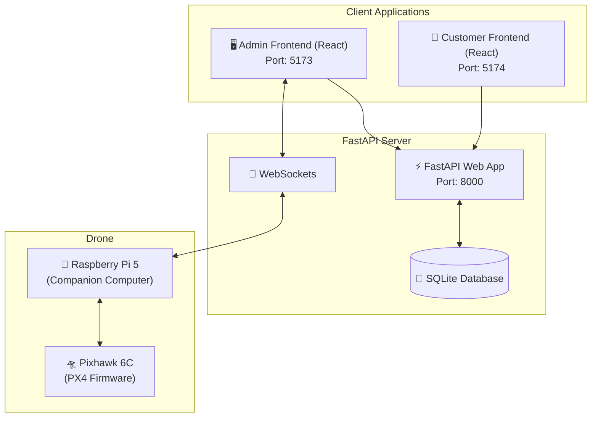

# Drone Delivery Autonomous System

Hệ thống giao hàng tự động bằng Drone chạy hoàn toàn trên mạng LAN nội bộ, điều khiển bằng Raspberry Pi 5 và Pixhawk 6C qua giao thức MAVLink.

---

## Tổng quan Kiến trúc



---

## Cấu trúc Monorepo

| Thư mục | Mô tả |
|---------|-------|
| `backend/` | FastAPI server, WebSocket hub, SQLite database |
| `frontend/` | React + TypeScript Admin Control Dashboard |
| `customer-frontend/` | React + TypeScript Customer Application |
| `companion/` | Ứng dụng chạy trên Raspberry Pi 5 (MAVLink, ArUco vision) |
| `docs/` | Tài liệu hệ thống chi tiết |

---

## Tài liệu Dự án

Hệ thống tài liệu đã được tổ chức lại để dễ theo dõi và bảo trì. Vui lòng tham khảo các tài liệu dưới đây theo nhu cầu của bạn:

- 📖 **[System Design (Thiết kế Hệ thống)](docs/system-design.md)**: Sơ đồ kiến trúc, luồng giao hàng, API, DB Schema và máy trạng thái FSM.
- 🚀 **[Deployment Guide (Hướng dẫn Triển khai)](docs/deployment-guide.md)**: Hướng dẫn chi tiết thiết lập phần cứng, mạng LAN, cấu hình Raspberry Pi (headless), cài đặt và chạy ứng dụng Backend/Frontend/Companion.
- ⚙️ **[PX4 Configuration (Cấu hình PX4)](docs/px4-configuration.md)**: Hướng dẫn đấu nối dây UART và toàn bộ các PX4 parameters cần thiết cho Pixhawk 6C.
- 🛠 **[RUNBOOK (Vận hành & Gỡ lỗi)](RUNBOOK.md)**: Các lệnh khởi chạy nhanh, checklist trước khi bay, hướng dẫn kiểm tra camera, MAVLink, WebSocket và khắc phục các sự cố thường gặp.

---

## Chạy Nhanh (Quick Start)

*(Xem chi tiết trong tài liệu Deployment Guide, đây chỉ là các lệnh tóm tắt)*

**1. Backend (Port 8000)**
```bash
cd backend
source venv/bin/activate
uvicorn app.main:app --host 0.0.0.0 --port 8000

 .\venv\Scripts\python.exe -m uvicorn app.main:app --host 0.0.0.0 --port 8000 --reload
```

**2. Frontend - Admin (Port 5173)**
```bash
cd frontend
npm run dev -- --host 0.0.0.0
```

**3. Frontend - Customer (Port 5174)**
```bash
cd customer-frontend
npm run dev -- --host 0.0.0.0 --port 5174
```

**4. Companion (Trên Raspberry Pi)**
```bash
sudo systemctl start drone-companion
journalctl -u drone-companion -f
```
