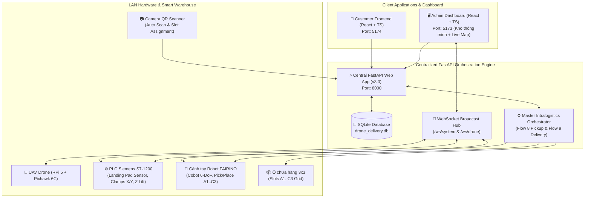

# Smart Intralogistics & Drone Delivery Autonomous System

Hệ thống giao hàng tự động bằng Drone kết hợp Trạm lưu kho thông minh (Smart Intralogistics Controller) chạy hoàn toàn trên mạng LAN nội bộ, điều khiển điều phối tập trung UAV, PLC Siemens S7-1200 Docking Station, Cánh tay robot FAIRINO 6-DoF, Camera QR Vision và Ô chứa hàng 3x3 (A1..C3).

---

## Tổng quan Kiến trúc System v3.0


```mermaid
graph TD
    subgraph ClientLayer [Client Applications & Dashboard]
        AdminApp["🖥️ Admin Dashboard (React + TS)<br/>Port: 5173 (Kho thông minh + Live Map)"]
        CustApp["📱 Customer Frontend (React + TS)<br/>Port: 5174"]
    end

    subgraph ServerLayer [Centralized FastAPI Orchestration Engine]
        API["⚡ Central FastAPI Web App (v3.0)<br/>Port: 8000"]
        DB[(💾 SQLite Database<br/>drone_delivery.db)]
        WSMgr["🔌 WebSocket Broadcast Hub<br/>(/ws/system & /ws/drone)"]
        FSM["⚙️ Master Intralogistics Orchestrator<br/>(Flow 8 Pickup & Flow 9 Delivery)"]
    end

    subgraph HardwareLayer [LAN Hardware & Smart Warehouse]
        UAV["🚁 UAV Drone (RPi 5 + Pixhawk 6C)"]
        PLC["⚙️ PLC Siemens S7-1200<br/>(Landing Pad Sensor, Clamps X/Y, Z Lift)"]
        ROBOT["🤖 Cánh tay Robot FAIRINO<br/>(Cobot 6-DoF, Pick/Place A1..C3)"]
        CAM["📷 Camera QR Scanner<br/>(Auto Scan & Slot Assignment)"]
        GRID["📦 Ô chứa hàng 3x3<br/>(Slots A1..C3 Grid)"]
    end

    CustApp --> API
    AdminApp --> API
    AdminApp <--> WSMgr
    WSMgr <--> UAV
    WSMgr <--> PLC
    WSMgr <--> ROBOT
    API <--> DB
    API <--> FSM
    FSM --> PLC
    FSM --> ROBOT
    FSM --> GRID
    CAM --> API
```

---

## Cấu trúc Monorepo

| Thư mục | Mô tả |
|---------|-------|
| `backend/` | FastAPI server (v3.0), System WebSocket hub, Orchestrator FSM, SQLite database |
| `frontend/` | React + TypeScript Admin Dashboard (Giao diện Kho thông minh 3x3, PLC, Robot, Live Map) |
| `customer-frontend/` | React + TypeScript Customer Application (Đặt đơn giao/nhận hàng) |
| `companion/` | Ứng dụng chạy trên Raspberry Pi 5 (MAVLink, ArUco vision precision landing) |
| `docs/` | Tài liệu kiến trúc hệ thống, hướng dẫn triển khai, cấu hình PX4 và Smart Intralogistics |

---

## Tài liệu Dự án

Hệ thống tài liệu đã được cập nhật cho phiên bản 3.0:

- 📖 **[System Design (Thiết kế Hệ thống)](docs/system-design.md)**: Sơ đồ kiến trúc tổng thể v3.0, FSM tự động kho thông minh (Flow 8 & 9), API v1 mới và Database ERD.
- 🏭 **[Smart Intralogistics Guide (Hướng dẫn Kho thông minh)](docs/smart-intralogistics-guide.md)**: Tài liệu chi tiết về tích hợp PLC Siemens S7-1200, Robot FAIRINO, ma trận kho 3x3 (A1..C3) và quy trình điều khiển.
- 🚀 **[Deployment Guide (Hướng dẫn Triển khai)](docs/deployment-guide.md)**: Hướng dẫn chi tiết thiết lập phần cứng, mạng LAN, cấu hình Raspberry Pi, PLC, Robot và các ứng dụng.
- ⚙️ **[PX4 Configuration (Cấu hình PX4)](docs/px4-configuration.md)**: Hướng dẫn đấu nối dây UART và toàn bộ các PX4 parameters cần thiết cho Pixhawk 6C.
- 🛠 **[RUNBOOK (Vận hành & Gỡ lỗi)](RUNBOOK.md)**: Các lệnh khởi chạy nhanh, test script `test_smart_intralogistics.py`, checklist trước khi bay và xử lý sự cố PLC/Robot/Drone.

---

## Chạy Nhanh (Quick Start)

**1. Backend Server & Smart Intralogistics (Port 8000)**
```bash
cd backend
# Khởi chạy server
.\venv\Scripts\python.exe -m uvicorn app.main:app --host 0.0.0.0 --port 8000 --reload

# Chạy Integration Test cho Smart Intralogistics (PLC, Robot, 3x3 Storage, FSM Flow 8 & 9)
.\venv\Scripts\python.exe test_smart_intralogistics.py
```

**2. Frontend - Admin Dashboard (Port 5173)**
```bash
cd frontend
npm run dev -- --host 0.0.0.0
```

**3. Frontend - Customer Application (Port 5174)**
```bash
cd customer-frontend
npm run dev -- --host 0.0.0.0 --port 5174
```

**4. Companion (Trên Raspberry Pi 5)**
```bash
sudo systemctl start drone-companion
journalctl -u drone-companion -f
```
------------------------------

### 📄 3 Cách Sử dụng File `generate_qr_pdf.py`

#### Cách 1: Nhập dữ liệu trực tiếp bằng bàn phím (Interactive Mode)
Chạy lệnh bên dưới và gõ thông tin theo hướng dẫn màn hình:
```bash
python generate_qr_pdf.py
```
* **Mã sản phẩm (ID)**: Nhập `SP001` hoặc `PROD-8899`.
* **Tên người gửi**: Nhập `Nguyen Van A` (hoặc bấm Enter để chọn mặc định).
* **Địa chỉ giao**: Nhập `Da Nang` (hoặc bấm Enter để chọn mặc định).
* $\rightarrow$ Đơn hàng sẽ tự động được đóng gói thành file PDF: **`QR_SP001.pdf`**.

---

#### Cách 2: Tạo nhanh bằng Dòng lệnh (CLI Command)
Chạy trực tiếp với các tham số mong muốn:
```bash
python generate_qr_pdf.py --id SP008 --sender "Tran Van B" --address "Ha Noi"
```

---

#### Cách 3: Tạo hàng loạt bộ 5 mã QR mẫu (Batch Mode)
Tạo sẵn 5 file PDF tem nhãn QR mẫu từ `SP001` đến `SP005` chỉ với 1 lệnh:
```bash
python generate_qr_pdf.py --batch
```

---

### 🌐 Tích hợp Endpoint API trên Backend (Web API)
Backend cũng đã được bổ sung đường dẫn **`POST /api/inventory/generate-qr-pdf`**. Bạn có thể gửi yêu cầu tạo và tải file PDF nhãn QR trực tiếp từ giao diện Web.

### 🖨️ Tính năng File PDF Tem Nhãn
- File PDF định dạng A4 chuẩn in ấn.
- Chứa mã QR hình ảnh sắc nét (chuẩn mã hóa JSON / String), USB Camera có thể quét trực tiếp từ màn hình máy tính hoặc giấy in.
- Bảng chi tiết: Mã sản phẩm, Người gửi, Địa chỉ, Ngày giờ tạo, Khung viền màu xanh công nghiệp nổi bật.