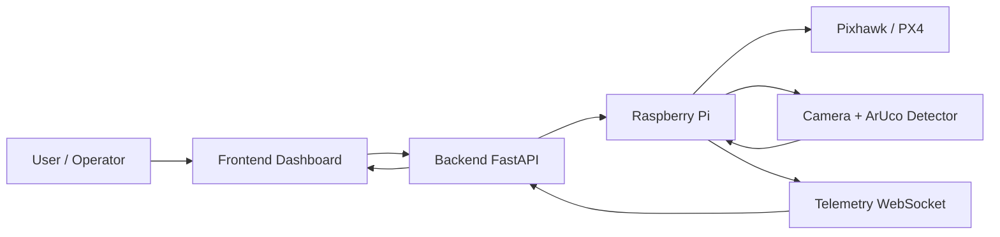

# HƯỚNG DẪN CHẠY THẬT & TEST HỆ THỐNG DRONE DELIVERY

Tài liệu này tổng hợp toàn bộ các bước để chạy hệ thống Drone Delivery trên môi trường LAN nội bộ, từ backend (SQLite), frontend, Raspberry Pi cho đến kiểm thử chức năng và kiểm thử camera/ArUco.

---

## TÓM TẮT TRẠNG THÁI HIỆN TẠI

- ✅ **Backend SQLite** — FastAPI + SQLAlchemy Async + SQLite (drone_delivery.db) đã khởi động thành công và API endpoints hoạt động.
- ✅ **Frontend** — React + Vite + TypeScript có khung vận hành đầy đủ trên mạng LAN nội bộ.
- ✅ **Raspberry Pi** — FSM, điều khiển lệnh từ server, telemetry relay và logic mission cơ bản đã tích hợp.
- 🔶 **Vision/ArUco** — Đang ở giai đoạn phát triển; hiện vẫn còn lỗi cần tiếp tục sửa để detection ổn định hơn.
- 🔶 **SITL/Hardware** — Chưa có chuyến bay thực tế end-to-end hoàn chỉnh, vì vậy phần tích hợp vẫn ở giai đoạn chuẩn bị.

### Trạng thái tổng quát
- Hệ thống: đang vận hành ở mức prototype/điều khiển thử nghiệm.
- Mức độ hoàn thiện: Backend/Frontend đã sẵn sàng hoạt động, Pi mission flow có nền tảng ổn định, vision precision landing còn đang hoàn thiện.

---

## 1. YÊU CẦU MÔI TRƯỜNG

### 1.1 Phần cứng
- Máy tính trung tâm chạy backend + frontend
- Raspberry Pi 4 nối với Pixhawk 6C
- Camera CSI hoặc webcam để test vision
- Wi-Fi LAN nội bộ, các thiết bị cùng mạng

### 1.2 Phần mềm
- Python 3.10+ (khuyến cáo 3.12+)
- Node.js 18+
- SQLite3 (đã tích hợp sẵn trong Python)
- PowerShell hoặc terminal tương thích

### 1.3 Cấu hình mạng LAN
Các thiết bị nên dùng cấu hình tương ứng trong params_system.json:
- Server: 192.168.2.28
- Raspberry Pi: 192.168.2.100
- Backend port: 8000
- Frontend port: 3000

---

## 2. CHECKLIST CHẠY TRÊN RASPBERRY PI THẬT

### 2.1 Chuẩn bị trước khi chạy
- [ ] Đảm bảo Raspberry Pi đã kết nối đúng mạng LAN nội bộ.
- [ ] Đặt IP tĩnh cho Pi theo cấu hình trong params_system.json: 192.168.1.10.
- [ ] Kiểm tra Pi có thể ping tới server ở 192.168.1.100.
- [ ] Kiểm tra camera đã kết nối và có thể mở được.
- [ ] Kiểm tra Pixhawk đã nối đúng UART/serial và có nguồn điện ổn định.
- [ ] Đảm bảo môi trường Python trên Pi đã cài đầy đủ dependency từ raspberry-pi/requirements.txt.

### 2.2 Khởi động hệ thống trên Pi
- [ ] SSH vào Pi hoặc dùng terminal trực tiếp.
- [ ] Kích hoạt môi trường Python nếu cần.
- [ ] Chạy lệnh:
```powershell
cd /home/pi/DroneDelivery/raspberry-pi
export PYTHONPATH=$PWD/src
python3 src/main.py
```
- [ ] Xác nhận Pi bắt đầu chạy mission manager và kết nối tới backend qua WebSocket.

### 2.3 Kiểm tra kết nối với Backend
- [ ] Mở health check backend trên server: http://192.168.1.100:8000/health.
- [ ] Xác nhận Pi có log hiển thị kết nối tới server thành công.
- [ ] Kiểm tra telemetry đầu tiên xuất hiện trên dashboard frontend.

### 2.4 Kiểm tra camera và ArUco
- [ ] Chạy test camera:
```powershell
cd /home/pi/DroneDelivery/raspberry-pi
export PYTHONPATH=$PWD/src
python3 tools/test_webcam_aruco.py
```
- [ ] Nếu có marker trong khung hình, xác nhận marker được vẽ và offset hiển thị.
- [ ] Nếu không phát hiện marker, kiểm tra ánh sáng, góc nhìn và dictionary ArUco.

### 2.5 Kiểm tra mission flow cơ bản
- [ ] Gửi lệnh START/ARM từ frontend hoặc backend.
- [ ] Xác nhận Pi chuyển sang trạng thái ARM.
- [ ] Xác nhận Pi chuyển sang TAKEOFF và telemetry cập nhật đúng.
- [ ] Xác nhận Pi có thể chuyển sang SEARCH_ARUCO / PRECISION_LANDING khi marker xuất hiện.

### 2.6 Kiểm tra failsafe an toàn
- [ ] Ngắt kết nối mạng hoặc server để kiểm tra RTL/failsafe.
- [ ] Xác nhận Pi chuyển sang RETURN_HOME hoặc trạng thái an toàn khi mất kết nối.
- [ ] Ghi log các state transition để debug.

### 2.7 Dừng hệ thống
- [ ] Dùng Ctrl+C để dừng process trên Pi.
- [ ] Kiểm tra hệ thống không còn gửi telemetry sai hoặc lỗi.
- [ ] Ghi nhận lại kết quả thử nghiệm để cải tiến tiếp.

---

## 3. CÀI ĐẶT MÔI TRƯỜNG

### 2.1 Tạo và kích hoạt virtual environment Python

PowerShell:
```powershell
cd C:\Users\MSI GAMING\Desktop\DroneDelivery
python -m venv .venv
Set-ExecutionPolicy -Scope Process -ExecutionPolicy RemoteSigned
.\.venv\Scripts\Activate.ps1
```

### 2.2 Cài đặt Python dependencies
```powershell
pip install -r server\backend\requirements.txt
pip install -r raspberry-pi\requirements.txt
```

### 2.3 Cài đặt frontend dependencies
```powershell
cd frontend
npm install
```

### 2.4 Chuẩn bị database SQLite
- SQLite đã tích hợp sẵn trong Python, **không cần cài đặt riêng**
- Database file `drone_delivery.db` sẽ được tạo tự động khi backend khởi động lần đầu
- Nếu muốn xóa db và khởi tạo lại: xóa file `server/backend/drone_delivery.db`

---

## 3. CHẠY HỆ THỐNG THẬT

### 3.1 Chạy Backend (SQLite)
```powershell
cd C:\Users\MSI GAMING\Desktop\DroneDelivery
.\.venv\Scripts\Activate.ps1
cd server\backend
# Bind to all interfaces so Pi / other machines in LAN can connect
python -m uvicorn main:app --host 0.0.0.0 --port 8000 --log-level info
```

Kiểm tra backend:
```
http://192.168.2.28:8000/health
```

⚠️ **Lưu ý:**
- Backend sử dụng **SQLite** (không cần PostgreSQL)
- Database file: `server/backend/drone_delivery.db`
- Port mặc định: 8001 (nếu port 8000 bận, dùng port khác)
- Các bảng sẽ được tạo tự động khi backend khởi động lần đầu

### 3.2 Chạy Frontend
```powershell
cd C:\Users\MSI GAMING\Desktop\DroneDelivery\frontend
npm run dev -- --host 0.0.0.0 --port 3000
```

Truy cập giao diện:
```text
http://192.168.2.28:3000
```

### 3.3 Chạy Raspberry Pi Application
Trên Pi thật hoặc máy tính test:
```powershell
cd C:\Users\MSI GAMING\Desktop\DroneDelivery\raspberry-pi
$env:PYTHONPATH = "$PWD\src"
python src\main.py
```

Nếu dùng script tự động:
```powershell
bash run.sh
```

### 3.4 Kết nối với Pixhawk
- Kiểm tra cổng UART/serial
- Đảm bảo MAVLink đang kết nối đúng baudrate
- Nếu dùng simulator hoặc test trên máy tính, cần cấu hình đúng target serial

### 3.5 Chạy test camera/ArUco (nếu cần kiểm tra vision)
```powershell
cd C:\Users\MSI GAMING\Desktop\DroneDelivery\raspberry-pi
$env:PYTHONPATH = "$PWD\src"
python tools\test_webcam_aruco.py
```

---

## 4. CHẠY TEST HỆ THỐNG

### 4.1 Test backend import / health
```powershell
cd C:\Users\MSI GAMING\Desktop\DroneDelivery\server\backend
python -c "import main; print('backend ok')"
```

### 4.2 Test frontend build
```powershell
cd C:\Users\MSI GAMING\Desktop\DroneDelivery\frontend
npm run build
```

### 4.3 Test Raspberry Pi mission manager
```powershell
cd C:\Users\MSI GAMING\Desktop\DroneDelivery\raspberry-pi
$env:PYTHONPATH = "$PWD\src"
python -m unittest tests.test_mission_manager_commands
```

### 4.4 Test import module Pi
```powershell
cd C:\Users\MSI GAMING\Desktop\DroneDelivery\raspberry-pi
$env:PYTHONPATH = "$PWD\src"
python -m unittest tests.test_main_import
```

### 4.5 Test camera ArUco trực tiếp
```powershell
cd C:\Users\MSI GAMING\Desktop\DroneDelivery\raspberry-pi
$env:PYTHONPATH = "$PWD\src"
python tools\test_webcam_aruco.py
```

---

## 5. LUỒNG HOẠT ĐỘNG HỆ THỐNG

### 5.1 Luồng vận hành tổng quát
1. Người vận hành mở dashboard trên frontend.
2. Frontend gửi lệnh hoặc mission tới backend qua HTTP/REST.
3. Backend relay lệnh tới Raspberry Pi qua WebSocket.
4. Raspberry Pi nhận lệnh và điều phối qua state machine (FSM).
5. Pi gửi các lệnh MAVLink tới Pixhawk để ARM, TAKEOFF, di chuyển, RTL hoặc LAND.
6. Nếu đang ở giai đoạn landing, camera trên Pi chạy nhận diện ArUco marker.
7. Pi tính offset, yaw error và gửi telemetry về backend/frontend.
8. Frontend hiển thị trạng thái drone, mission phase, vision metadata và log hệ thống.

### 5.2 Sơ đồ luồng


### 5.3 Luồng mission chính
```text
IDLE -> ARMING -> TAKEOFF -> FLY_TO_PICKUP -> DESCEND -> SEARCH_ARUCO -> PRECISION_LANDING -> WAIT_PICKUP_CONFIRM (Landed/Disarmed) -> ARMING -> TAKEOFF -> FLY_TO_DROP -> DESCEND -> SEARCH_ARUCO -> PRECISION_LANDING -> WAIT_DROP_CONFIRM (Landed/Disarmed) -> ARMING -> RETURN_HOME (Landed/Disarmed) -> IDLE
```

---

## 6. CÁC VẤN ĐỀ THƯỜNG GẶP

### 6.1 Backend không khởi động
- Kiểm tra cổng 8001 (hoặc port bạn sử dụng) có đang bận không
- Kiểm tra file `drone_delivery.db` nếu muốn xóa toàn bộ dữ liệu và khởi tạo lại
- Kiểm tra tất cả dependencies đã cài đặt: `pip install -r server/backend/requirements.txt`
- Kiểm tra phiên bản Python: `python --version` (khuyến cáo 3.12+)

### 6.2 Frontend không kết nối được backend
- Đảm bảo backend đang chạy trên `127.0.0.1:8001` (hoặc port tương ứng)
- Kiểm tra CORS configuration trong `server/backend/app/core/config.py`
- Kiểm tra environment variables trong `.env` file
- Kiểm tra firewall cho phép kết nối local

### 6.3 Pi không kết nối được server
- Kiểm tra Pi và server cùng mạng LAN
- Kiểm tra firewall và cổng 8000
- Kiểm tra WebSocket URL

### 6.4 Camera/ArUco không phát hiện marker
- Kiểm tra camera nguồn sáng và độ nét
- Đổi dictionary ArUco phù hợp
- Chạy tool test_webcam_aruco.py để debug trước khi bay thật

---

## 7. MẸO VẬN HÀNH AN TOÀN
- Không chạy mission thật trước khi test camera và state machine xong
- Luôn có fail-safe cho mất kết nối server hoặc mất heartbeat
- Nếu phát hiện marker không ổn định, ưu tiên quay về RTL thay vì tiếp tục hạ cánh
- Ghi log đầy đủ mỗi lần chạy thử

---

## 8. CẬP NHẬT GẦN ĐÂY (2026-07-13)

### Tối Ưu Logic Vận Hành (FSM) & Tương Tác Người Dùng
- **PX4 Auto-Disarm Integration:** Cập nhật FSM để nhận biết hành vi tự động Disarm sau khi chạm đất (Landed) của PX4. Loại bỏ các lệnh Disarm thủ công dư thừa từ Companion.
- **User Confirm Gates:** Thêm hai trạng thái dừng chờ `WAIT_PICKUP_CONFIRM` và `WAIT_DROP_CONFIRM` sau khi hạ cánh để người vận hành xác nhận an toàn trước khi cất cánh tiếp qua các nút `PICKUP OK` và `DROP OK`.
- **Continuous Delivery Mode:** Cho phép kích hoạt lại nút `START MISSION` khi drone đang trên đường bay về (`RETURN_HOME`). Người dùng có thể gửi ngay vị trí pickup mới để drone thực hiện cất cánh tiếp tục mà không cần đợi đáp về Home hoàn toàn.
- **Safety Features:** Đảm bảo lệnh ARM chỉ gửi một lần duy nhất mỗi lần chuyển trạng thái cất cánh và chờ xác nhận `armed=True` từ heartbeat của PX4 trước khi Takeoff.

### Database Migration: PostgreSQL → SQLite
- ✅ Backend đã chuyển từ PostgreSQL sang SQLite3
- ✅ Database file tự động tạo: `server/backend/drone_delivery.db`
- ✅ Tất cả API endpoints (CRUD) hoạt động đúng
- ✅ Data persistence được kiểm chứng qua test tạo và truy xuất Orders

### Performance & Stability
- Backend khởi động nhanh hơn (~1 giây)
- Không cần cấu hình external database
- Phù hợp cho development, testing, và deployment trên Pi
