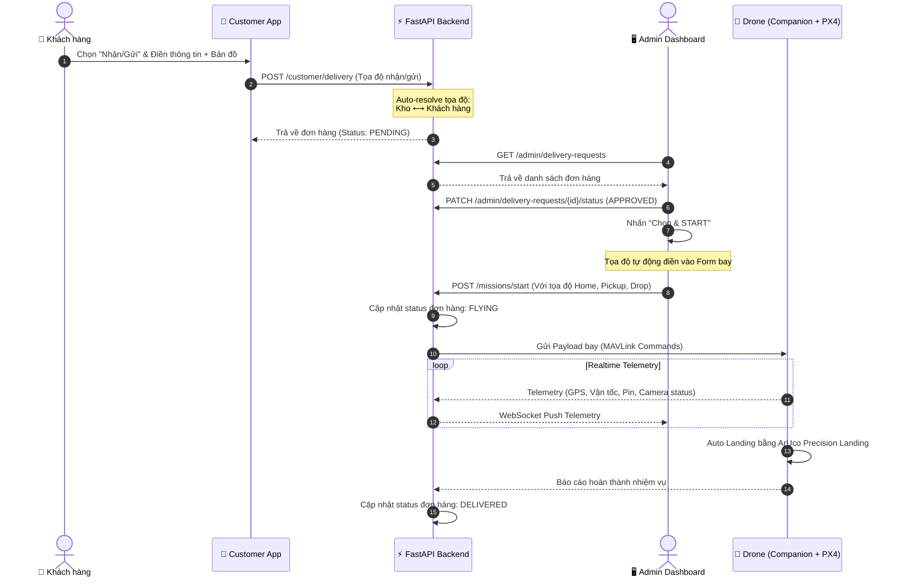
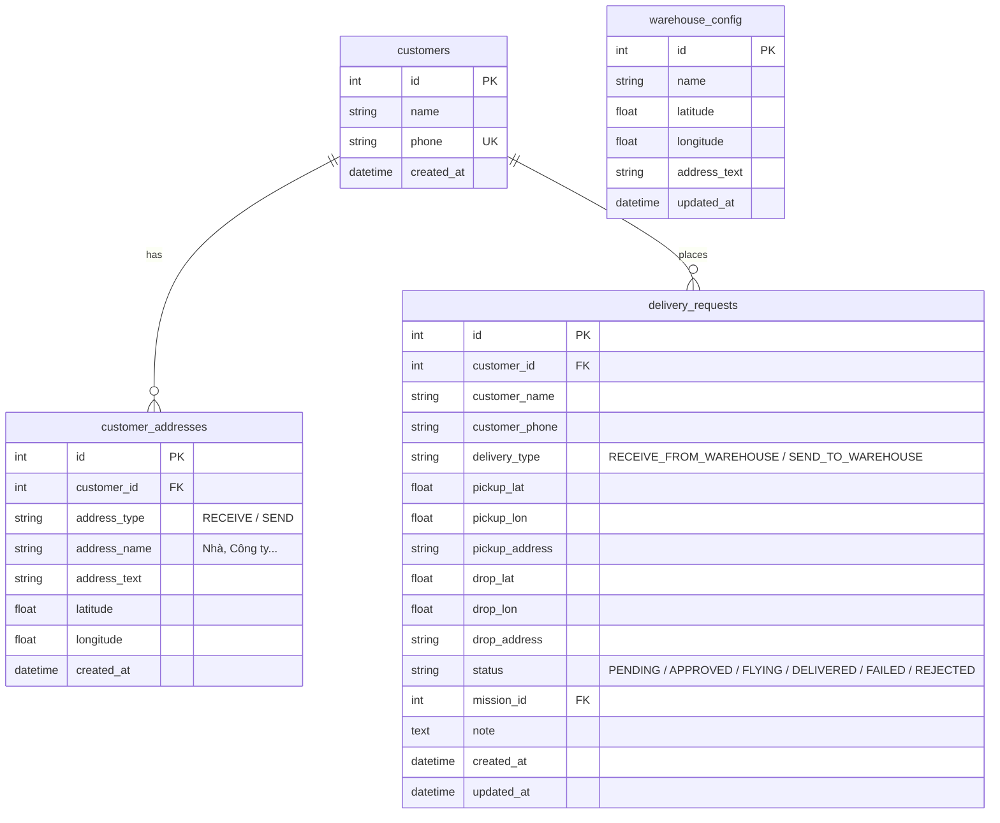
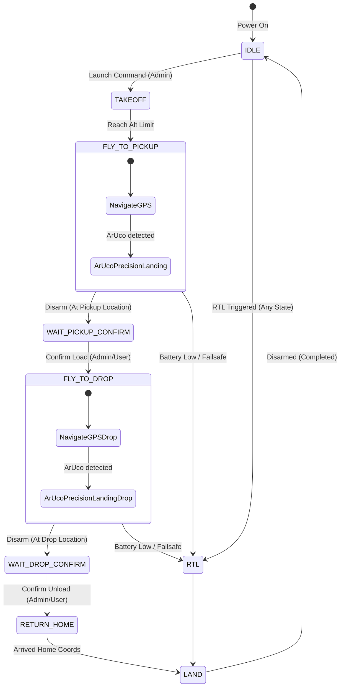

# Thiết kế Hệ thống (System Design)

Tài liệu này cung cấp cái nhìn tổng quát về kiến trúc hệ thống, cơ sở dữ liệu, các giao thức kết nối, và máy trạng thái hữu hạn (FSM) điều khiển chuyến bay.

---

## 1. Sơ đồ Kiến trúc Hệ thống

```mermaid
graph TD
    subgraph ClientLayer [Client Applications]
        AdminApp["🖥️ Admin Frontend (React + TS)<br/>Port: 5173"]
        CustApp["📱 Customer Frontend (React + TS)<br/>Port: 5174"]
    end

    subgraph ServerLayer [FastAPI Server]
        API["⚡ FastAPI Web App<br/>Port: 8000"]
        DB[(💾 SQLite Database<br/>drone_delivery.db)]
        ConnMgr["🔌 Connection Manager<br/>(WebSockets)"]
    end

    subgraph HardwareLayer [Drone & Companion Computer]
        RPi["🍓 Raspberry Pi 5<br/>(Companion Computer)"]
        Pixhawk["🛸 Pixhawk 6C<br/>(Flight Controller / PX4)"]
        Cam["📷 RPi Camera<br/>(ArUco Landing / Stream)"]
    end

    CustApp -->|HTTP REST API| API
    AdminApp -->|HTTP REST API| API
    AdminApp <-->|WebSockets (Telemetry & Cmds)| ConnMgr
    ConnMgr <-->|WebSockets| RPi
    
    API <-->|SQLAlchemy Async| DB
    RPi <-->|MAVLink (Serial/Telem)| Pixhawk
    RPi -->|Camera Interface| Cam

    style AdminApp fill:#2a3a52,stroke:#3b82f6,stroke-width:2px,color:#fff
    style CustApp fill:#1f2d45,stroke:#8b5cf6,stroke-width:2px,color:#fff
    style API fill:#111827,stroke:#10b981,stroke-width:2px,color:#fff
    style DB fill:#111827,stroke:#f59e0b,stroke-width:2px,color:#fff
    style RPi fill:#800020,stroke:#ef4444,stroke-width:2px,color:#fff
    style Pixhawk fill:#333,stroke:#666,stroke-width:2px,color:#fff
```

---

## 2. Luồng Nghiệp vụ Giao hàng (Delivery Flow)



---

## 3. Thiết kế Cơ sở Dữ liệu (ERD)

Hệ thống sử dụng SQLite với 4 bảng dữ liệu cốt lõi phục vụ nghiệp vụ (version 2.0).



---

## 4. Tài liệu API (RESTful Endpoints)

### 4.1. Dành cho Khách hàng (Customer API)
* **`GET /warehouse`**: Lấy vị trí GPS của kho hàng đang được cấu hình.
* **`POST /customer/delivery`**: Đặt đơn hàng mới (Nhận hàng từ kho hoặc Gửi hàng về kho).
* **`GET /customer/delivery?phone={phone}`**: Tra cứu lịch sử đơn hàng theo số điện thoại.
* **`POST /customer/address`**: Thêm một địa chỉ nhận/gửi mới.
* **`GET /customer/address?customer_id={id}`**: Lấy danh sách địa chỉ đã lưu.
* **`PUT /customer/address/{id}`**: Cập nhật địa chỉ đã lưu.
* **`DELETE /customer/address/{id}`**: Xóa địa chỉ.

### 4.2. Dành cho Quản trị viên (Admin API)
* **`GET /admin/delivery-requests`**: Xem danh sách đơn hàng (hỗ trợ lọc `PENDING`, `APPROVED`, `FLYING`,...).
* **`PATCH /admin/delivery-requests/{id}/status`**: Cập nhật trạng thái đơn hàng (Duyệt, Từ chối).
* **`GET /admin/warehouse`**: Xem cấu hình chi tiết của kho hàng.
* **`PUT /admin/warehouse`**: Chỉnh sửa vị trí (GPS), tên kho hoặc địa chỉ.

---

## 5. Máy Trạng thái Chuyến bay (Flight Control FSM)

Toàn bộ quy trình điều khiển Drone được mô hình hóa qua Finite State Machine (FSM).


