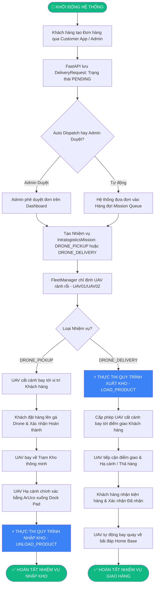
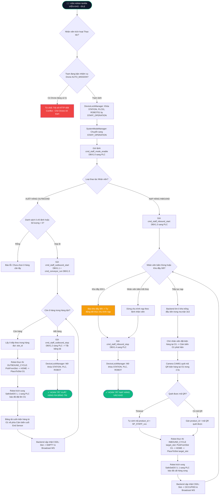
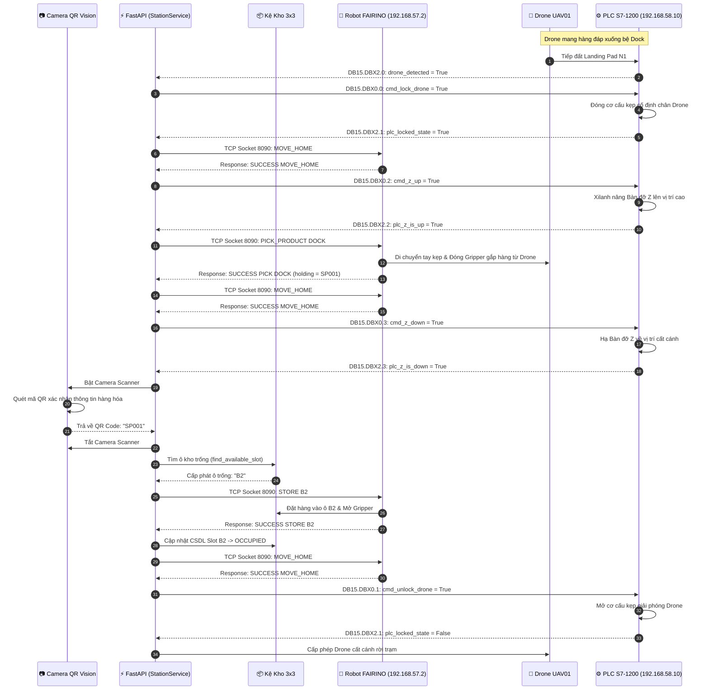
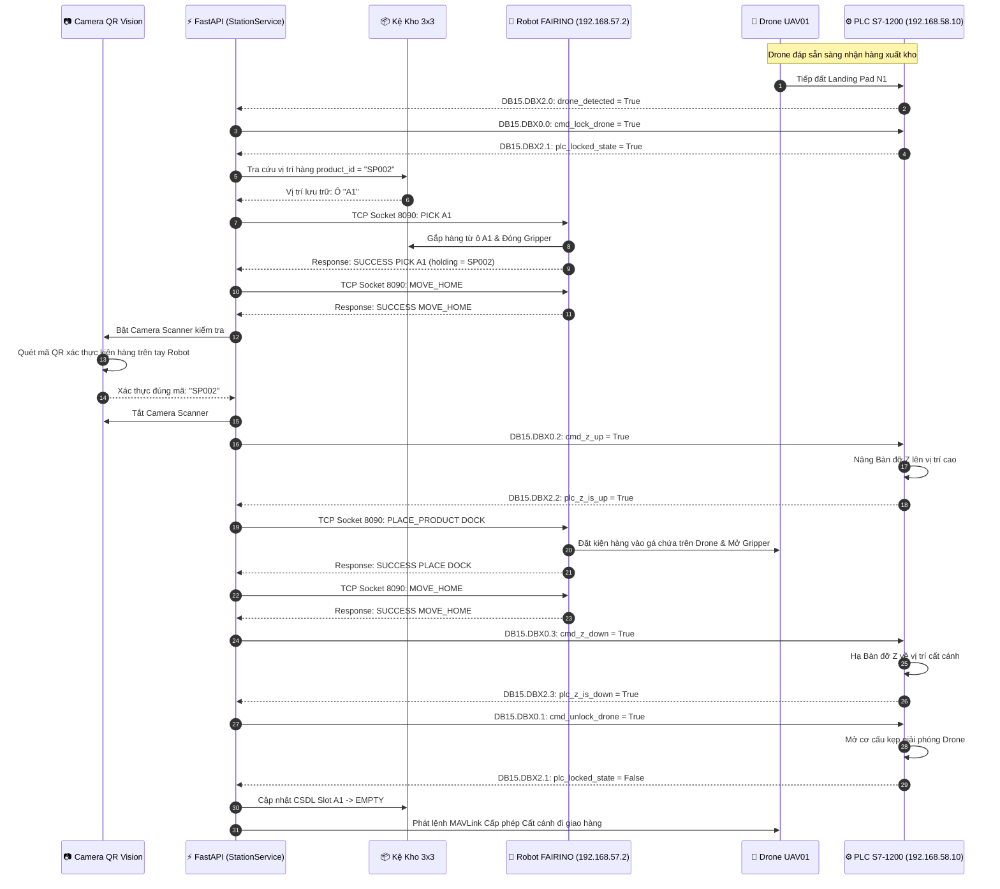
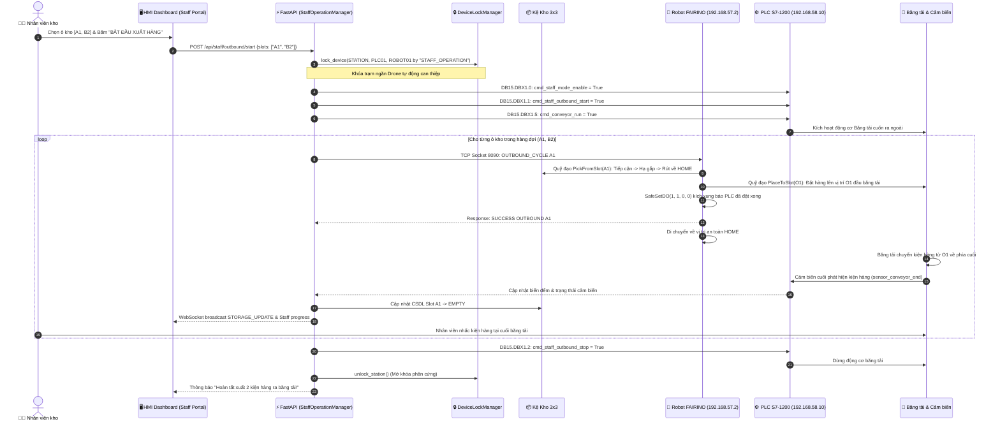
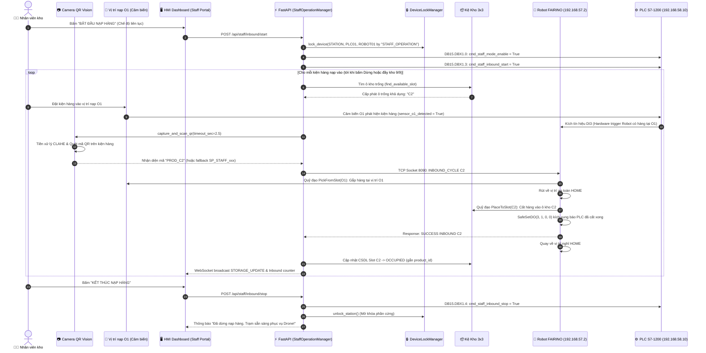
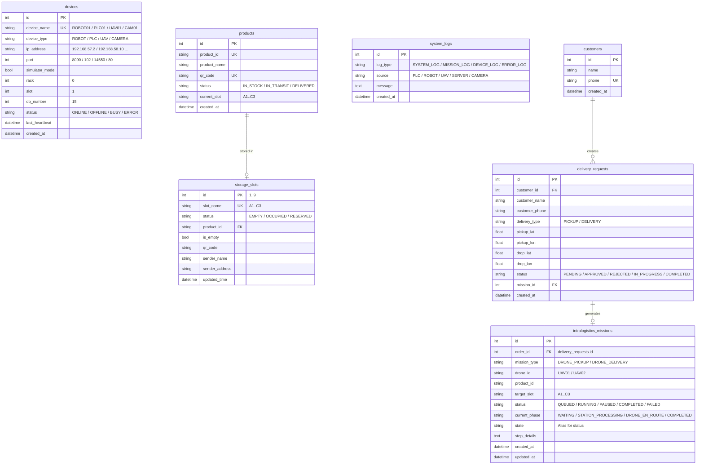

# Thiết kế Hệ thống (System Design v3.0)

Tài liệu này cung cấp thiết kế kiến trúc tổng thể và chi tiết cho hệ thống **Giao hàng bằng Drone kết hợp Trạm lưu kho thông minh (Smart Intralogistics Controller System v3.0)**, bao gồm:
* Kiến trúc 4 tầng phân tách (Decoupled 4-Layer Architecture).
* **Lưu đồ Thuật toán Tổng thể Toàn Hệ thống (Master System Flowchart)**.
* **Lưu đồ Thuật toán Tổng cho Trạm Kho Đáp Thông Minh (Smart Docking Station Orchestration Flowchart - Gồm PLC, Robot, Camera, Kho 9 ô & Backend)**.
* **Lưu đồ Thuật toán Chuyên sâu cho UAV (UAV Autonomous Flight & Precision Landing Flowchart)**.
* Trình tự bắt tay tín hiệu (Sequence Diagrams).
* Bảng ánh xạ bộ nhớ PLC DB15, giao thức TCP Socket Robot & MAVLink.
* Thiết kế Cơ sở Dữ liệu (ERD v3.0) & Danh mục API REST / WebSocket.

---

## 1. Sơ đồ Kiến trúc Hệ thống (v3.0)

### 1.1. Sơ đồ Khối Kiến trúc Phần cứng & Phần mềm

```mermaid
graph TD
    subgraph ClientLayer [Client Applications & Web Interfaces]
        AdminApp["🖥️ Admin HMI Dashboard (React + TypeScript)<br/>Port: 5173 (Kho thông minh + Live Map + Device Config)"]
        CustApp["📱 Customer Web App (React + TypeScript)<br/>Port: 5174 (Tạo đơn hàng, Đặt vị trí nhận/giao)"]
    end

    subgraph ServerLayer [Centralized FastAPI Orchestration Engine (Layer 2 & 3)]
        API["⚡ Central FastAPI Server (Port: 8000)<br/>REST Endpoints & Hardware Routers"]
        DB[(💾 SQLite Database<br/>drone_delivery.db)]
        WSMgr["🔌 WebSocket Hub<br/>/ws/system & /ws/drone"]
        StationSvc["🏭 Station Controller Service<br/>(11-Step FSM: LOAD & UNLOAD)"]
        MissionMgr["🎯 Mission Manager / Dispatcher<br/>(FIFO Queue & Lifecycle Orchestration)"]
    end

    subgraph WarehouseHardware [LAN Smart Docking Station (Layer 4)]
        PLC["⚡ Siemens S7-1200 PLC (IP: 192.168.58.10:102)<br/>Snap7 DB15: Pad Sensor, Clamps X/Y, Lift Z"]
        ROBOT["🤖 FAIRINO FR3 Cobot (IP: 192.168.57.2:8090)<br/>TCP Socket: Pick/Store, Gripper, Safe Home"]
        CAM["📷 QR Code Scanner Camera (IP: 192.168.58.50:80)<br/>OpenCV Vision: Quét mã QR & Gán ô tự động"]
        GRID["📦 Kệ Kho Thông Minh 9 Ô (3x3 Grid)<br/>Quản lý lưu trữ Slots A1..C3"]
    end

    subgraph UAVHardware [UAV Fleet & Flight Control Unit]
        RPi["🍓 Companion Computer (Raspberry Pi 5)<br/>IP: 192.168.137.88 (WebSocket /ws/drone)"]
        Pixhawk["🛸 Flight Controller (Pixhawk 6C)<br/>PX4 Autopilot / MAVLink UART"]
        ArUcoCam["📷 Downward USB Camera<br/>ArUco Marker Precision Landing (25Hz)"]
    end

    CustApp -->|HTTP REST| API
    AdminApp -->|HTTP REST| API
    AdminApp <-->|WebSocket (/ws/system)| WSMgr
    WSMgr <-->|WebSocket (/ws/drone)| RPi
    
    API <-->|SQLAlchemy Async| DB
    API <--> MissionMgr
    MissionMgr <--> StationSvc
    
    StationSvc -->|Snap7 ISO-on-TCP DB15| PLC
    StationSvc -->|CRLF TCP Socket 8090| ROBOT
    StationSvc -->|QR Scan API / Stream| CAM
    StationSvc -->|Inventory Update| GRID

    RPi <-->|MAVLink Protocol| Pixhawk
    RPi -->|OpenCV Stream| ArUcoCam

    style AdminApp fill:#1e293b,stroke:#00f0ff,stroke-width:2px,color:#fff
    style CustApp fill:#1e293b,stroke:#8b5cf6,stroke-width:2px,color:#fff
    style API fill:#0f172a,stroke:#10b981,stroke-width:2px,color:#fff
    style DB fill:#0f172a,stroke:#f59e0b,stroke-width:2px,color:#fff
    style StationSvc fill:#1e3a8a,stroke:#38bdf8,stroke-width:2px,color:#fff
    style MissionMgr fill:#1e3a8a,stroke:#3b82f6,stroke-width:2px,color:#fff
    style PLC fill:#064e3b,stroke:#10b981,stroke-width:2px,color:#fff
    style ROBOT fill:#581c87,stroke:#c084fc,stroke-width:2px,color:#fff
    style CAM fill:#78350f,stroke:#f59e0b,stroke-width:2px,color:#fff
    style GRID fill:#1f2937,stroke:#94a3b8,stroke-width:2px,color:#fff
    style RPi fill:#831843,stroke:#ec4899,stroke-width:2px,color:#fff
    style Pixhawk fill:#701a75,stroke:#e879f9,stroke-width:2px,color:#fff
```

---

### 1.2. Bảng Thông số Phần cứng & Kết nối Mạng LAN

| Thiết bị | Device Type | IP Mặc định | Cổng (Port) | Giao thức | Chức năng chính |
| :--- | :--- | :--- | :---: | :--- | :--- |
| **ROBOT01** | `ROBOT` | `192.168.57.2` | `8090` | TCP Socket (CRLF) | Cánh tay Robot FAIRINO FR3 gắp/đặt hàng hóa giữa ô kho và gá Drone |
| **PLC01** | `PLC` | `192.168.58.10` | `102` | Siemens Snap7 (DB15) | Điều khiển kẹp khóa Drone X/Y, bàn nâng trục Z, cảm biến tiếp đất |
| **UAV01** | `UAV` | `192.168.137.88` | `14550` / `8000` | MAVLink / WebSocket | Drone giao nhận hàng tự động kết nối Companion RPi 5 + Pixhawk 6C |
| **CAM01** | `CAMERA` | `192.168.58.50` | `80` / `554` | HTTP / RTSP Stream | Camera thị giác máy quét mã QR nhận diện sản phẩm nhập/xuất kho |

---

## 2. Lưu đồ Thuật toán Tổng thể Toàn Hệ thống (Master System Flowchart)

Lưu đồ dưới đây mô tả luồng điều phối cấp cao xuyên suốt từ khi Khách hàng gửi đơn hàng, Hệ thống duyệt, Điều phối Drone bay, cho đến khi Trạm kho hoàn tất giao/nhận kiện hàng:


```mermaid
flowchart TD
    Start([🚀 KHỞI ĐỘNG HỆ THỐNG]) --> ReceiveOrder[Khách hàng tạo Đơn hàng qua Customer App / Admin]
    ReceiveOrder --> SaveDB[FastAPI lưu DeliveryRequest: Trạng thái PENDING]
    SaveDB --> DispatchCheck{Auto Dispatch hay Admin Duyệt?}

    DispatchCheck -->|Admin Duyệt| ManualApprove[Admin phê duyệt đơn trên Dashboard]
    DispatchCheck -->|Tự động| AutoQueue[Hệ thống đưa đơn vào Hàng đợi Mission Queue]

    ManualApprove --> CreateMission[Tạo Nhiệm vụ IntralogisticsMission: DRONE_PICKUP hoặc DRONE_DELIVERY]
    AutoQueue --> CreateMission

    CreateMission --> AssignFleet[FleetManager chỉ định UAV rảnh rỗi - UAV01/UAV02]
    AssignFleet --> CheckMissionType{Loại Nhiệm vụ?}

    %% Nhánh 1: DRONE_PICKUP (Khách gửi hàng -> Drone lấy hàng về kho)
    CheckMissionType -->|DRONE_PICKUP| UAVFlyToCustomer[UAV cất cánh bay tới vị trí Khách hàng]
    UAVFlyToCustomer --> CustomerHandover[Khách đặt hàng lên gá Drone & Xác nhận Hoàn thành]
    CustomerHandover --> UAVFlyToWarehouse1[UAV bay về Trạm Kho thông minh]
    UAVFlyToWarehouse1 --> ArUcoLanding1[UAV Hạ cánh chính xác bằng ArUco xuống Dock Pad]
    ArUcoLanding1 --> StationUnloadProcess[⚡ THỰC THI QUY TRÌNH NHẬP KHO - UNLOAD_PRODUCT]
    StationUnloadProcess --> MissionPickupDone([✅ HOÀN TẤT NHIỆM VỤ NHẬP KHO])

    %% Nhánh 2: DRONE_DELIVERY (Xuất hàng từ kho -> Drone giao tới khách)
    CheckMissionType -->|DRONE_DELIVERY| StationLoadProcess[⚡ THỰC THI QUY TRÌNH XUẤT KHO - LOAD_PRODUCT]
    StationLoadProcess --> UAVTakeoffDelivery[Cấp phép UAV cất cánh bay tới điểm giao Khách hàng]
    UAVTakeoffDelivery --> ArUcoLanding2[UAV tiếp cận điểm giao & Hạ cánh / Thả hàng]
    ArUcoLanding2 --> CustomerReceive[Khách hàng nhận kiện hàng & Xác nhận Đã nhận]
    CustomerReceive --> UAVReturnHome[UAV tự động bay quay về bãi đáp Home Base]
    UAVReturnHome --> MissionDeliveryDone([✅ HOÀN TẤT NHIỆM VỤ GIAO HÀNG])

    style Start fill:#10b981,color:#fff
    style MissionPickupDone fill:#10b981,color:#fff
    style MissionDeliveryDone fill:#10b981,color:#fff
    style StationUnloadProcess fill:#3b82f6,color:#fff
    style StationLoadProcess fill:#3b82f6,color:#fff
```

---

## 3. ⭐ Lưu đồ Thuật toán Tổng cho Trạm Kho Đáp Thông Minh (Smart Docking Station Master Flowchart)

Lưu đồ này tích hợp toàn diện sự phối hợp giữa **Central Backend (StationService / Layer 3)** với toàn bộ phần cứng tại trạm: **PLC S7-1200 (DB15)**, **Robot FAIRINO FR3 (TCP Socket)**, **Camera QR Scanner (Vision)** và **Kệ kho 9 ô (Slots A1..C3)**:


```mermaid
flowchart TD
    StationInit([🏭 TRẠM KHO ĐÁP SẴN SÀNG - IDLE]) --> ListenEvent{Sự kiện Điều phối từ Backend?}

    %% -------------------------------------------------------------
    %% NHÁNH 1: QUY TRÌNH XUẤT KHO - LOAD_PRODUCT
    %% -------------------------------------------------------------
    ListenEvent -->|Lệnh LOAD_PRODUCT| CheckStock{Tìm ô chứa mã product_id?}
    CheckStock -->|Không tìm thấy| ErrorStock[Báo lỗi: PRODUCT_NOT_FOUND -> Hủy nhiệm vụ]
    CheckStock -->|Tìm thấy ô Target Slot| WaitDroneAtDock1[Chờ Drone đáp & PLC phát hiện drone_detected == TRUE]

    WaitDroneAtDock1 --> PLC_Lock1[1. Backend gửi cmd_lock_drone DBX0.0 -> PLC đóng kẹp X/Y]
    PLC_Lock1 --> VerifyLocked1{PLC phản hồi plc_locked_state == TRUE?}
    VerifyLocked1 -->|Timeout/Error| TriggerEStop1[Dừng khẩn cấp & Báo động E-Stop]
    VerifyLocked1 -->|Xác nhận Khóa| RobotPickStorage[2. Backend gửi lệnh PICK target_slot tới Robot FR3]

    RobotPickStorage --> RobotGripperClose1[Robot di chuyển tới ô kho & Đóng Gripper gắp hàng]
    RobotGripperClose1 --> RobotHome1[3. Robot di chuyển về vị trí an toàn HOME]
    RobotHome1 --> CamVerifyQR[4. Camera quét kiểm tra mã QR sản phẩm trên tay Robot]
    CamVerifyQR --> VerifyOK{Mã QR khớp product_id?}
    VerifyOK -->|Sai mã| AlarmWrongProduct[Dừng chu trình: Sai hàng hóa]
    VerifyOK -->|Khớp mã| PLC_ZUp1[5. Backend gửi cmd_z_up DBX0.2 -> PLC nâng Bàn nâng Z]

    PLC_ZUp1 --> VerifyZUp1{PLC phản hồi plc_z_is_up == TRUE?}
    VerifyZUp1 -->|Xác nhận Z Lên| RobotPlaceDock[6. Robot gửi lệnh PLACE DOCK đặt hàng lên gá Drone]
    RobotPlaceDock --> RobotGripperOpen1[Robot mở Gripper thả hàng lên Drone Dock]
    RobotGripperOpen1 --> RobotHome2[7. Robot rút về vị trí an toàn HOME]

    RobotHome2 --> PLC_ZDown1[8. Backend gửi cmd_z_down DBX0.3 -> PLC hạ Bàn nâng Z]
    PLC_ZDown1 --> VerifyZDown1{PLC phản hồi plc_z_is_down == TRUE?}
    VerifyZDown1 -->|Xác nhận Z Xuống| PLC_Unlock1[9. Backend gửi cmd_unlock_drone DBX0.1 -> PLC mở kẹp]
    
    PLC_Unlock1 --> VerifyUnlocked1{PLC phản hồi plc_locked_state == FALSE?}
    VerifyUnlocked1 -->|Mở khóa thành công| UpdateSlotEmpty[10. Cập nhật Ô kho Target Slot -> EMPTY trong DB]
    UpdateSlotEmpty --> NotifyTakeoffReady[11. Backend phát lệnh MAVLink Cấp phép Cất cánh cho Drone]
    NotifyTakeoffReady --> LoadComplete([✅ HOÀN THÀNH XUẤT KHO - READY FOR TAKEOFF])

    %% -------------------------------------------------------------
    %% NHÁNH 2: QUY TRÌNH NHẬP KHO - UNLOAD_PRODUCT
    %% -------------------------------------------------------------
    ListenEvent -->|Lệnh UNLOAD_PRODUCT| CheckFreeSlot{Tìm ô kho trống is_empty == TRUE?}
    CheckFreeSlot -->|Kho đầy 9/9 ô| ErrorFull[Báo lỗi: WAREHOUSE_FULL -> Chờ dọn kho]
    CheckFreeSlot -->|Cấp phát ô Target Slot| WaitDroneAtDock2[Chờ Drone đáp & PLC phát hiện drone_detected == TRUE]

    WaitDroneAtDock2 --> PLC_Lock2[1. Backend gửi cmd_lock_drone DBX0.0 -> PLC đóng kẹp X/Y]
    PLC_Lock2 --> VerifyLocked2{PLC phản hồi plc_locked_state == TRUE?}
    VerifyLocked2 -->|Timeout/Error| TriggerEStop2[Dừng khẩn cấp & Báo động E-Stop]
    VerifyLocked2 -->|Xác nhận Khóa| RobotHome3[2. Robot di chuyển về vị trí chuẩn bị HOME]

    RobotHome3 --> PLC_ZUp2[3. Backend gửi cmd_z_up DBX0.2 -> PLC nâng Bàn nâng Z]
    PLC_ZUp2 --> VerifyZUp2{PLC phản hồi plc_z_is_up == TRUE?}
    VerifyZUp2 -->|Xác nhận Z Lên| RobotPickDock[4. Robot gửi lệnh PICK DOCK gắp hàng từ Drone]
    RobotPickDock --> RobotGripperClose2[Robot đóng Gripper kẹp giữ chắc sản phẩm]

    RobotGripperClose2 --> RobotHome4[5. Robot rút về vị trí an toàn HOME]
    RobotHome4 --> PLC_ZDown2[6. Backend gửi cmd_z_down DBX0.3 -> PLC hạ Bàn nâng Z]
    PLC_ZDown2 --> VerifyZDown2{PLC phản hồi plc_z_is_down == TRUE?}
    VerifyZDown2 -->|Xác nhận Z Xuống| CamScanInbound[7. Camera Vision quét mã QR sản phẩm nhập kho]

    CamScanInbound --> RobotStoreSlot[8. Robot gửi lệnh STORE target_slot cất hàng vào ô chỉ định]
    RobotStoreSlot --> RobotGripperOpen2[Robot nhả Gripper đặt hàng ngay ngắn trong ô]
    RobotGripperOpen2 --> RobotHome5[9. Robot quay về vị trí nghỉ HOME]

    RobotHome5 --> PLC_Unlock2[10. Backend gửi cmd_unlock_drone DBX0.1 -> PLC mở kẹp]
    PLC_Unlock2 --> VerifyUnlocked2{PLC phản hồi plc_locked_state == FALSE?}
    VerifyUnlocked2 -->|Mở khóa thành công| UpdateSlotOccupied[11. Cập nhật Ô kho Target Slot -> OCCUPIED gắn product_id]
    UpdateSlotOccupied --> NotifyDroneDepart[12. Cấp phép Drone cất cánh rời bãi đáp]
    NotifyDroneDepart --> UnloadComplete([✅ HOÀN THÀNH NHẬP KHO - STORED IN SLOT])

    LoadComplete --> StationInit
    UnloadComplete --> StationInit

    style StationInit fill:#0f172a,stroke:#00f0ff,stroke-width:2px,color:#fff
    style LoadComplete fill:#10b981,color:#fff
    style UnloadComplete fill:#10b981,color:#fff
    style ErrorStock fill:#ef4444,color:#fff
    style ErrorFull fill:#ef4444,color:#fff
    style TriggerEStop1 fill:#ef4444,color:#fff
    style TriggerEStop2 fill:#ef4444,color:#fff
```

---

## 3.1. ⭐ Lưu đồ Thuật toán Chuyên sâu cho Chế độ Vận hành Nhân viên kho (Staff Operation Master Flowchart)

Lưu đồ dưới đây mô tả chi tiết toàn bộ chu trình nghiệp vụ khi trạm chuyển sang **Chế độ Nhân viên kho (`STAFF_OPERATION`)**: bao gồm kiểm tra **Khóa an toàn liên động (`Safety Interlock`)**, chu trình **Xuất hàng ra Băng tải (`Staff Outbound`)** và chu trình **Nạp hàng liên tục từ Vị trí O1 vào Kho (`Staff Inbound`)**:


```mermaid
flowchart TD
    StaffInit([👨‍💼 VẬN HÀNH NHÂN VIÊN KHO - IDLE]) --> RequestMode{Nhân viên kích hoạt Thao tác?}

    %% KIỂM TRA KHÓA AN TOÀN LIÊN ĐỘNG
    RequestMode --> CheckBusy{Trạm đang bận nhiệm vụ Drone AUTO_MISSION?}
    CheckBusy -->|Có Drone đang xử lý| RejectOp[Từ chối: Trả về HTTP 409 Conflict - Chờ Drone rời trạm]
    CheckBusy -->|Trạm rảnh| LockHW[DeviceLockManager: Khóa STATION, PLC01, ROBOT01 by STAFF_OPERATION]
    LockHW --> SwitchSysMode[SystemModeManager: Chuyển sang STAFF_OPERATION]
    SwitchSysMode --> EnablePLCStaff[Gửi lệnh cmd_staff_mode_enable DBX1.0 sang PLC]

    %% NHÁNH 1: XUẤT HÀNG RA BĂNG TẢI (STAFF_OUTBOUND)
    EnablePLCStaff --> SelectBranch{Loại thao tác Nhân viên?}
    SelectBranch -->|XUẤT HÀNG OUTBOUND| CheckQueue{Danh sách ô chỉ định hoặc Số lượng > 0?}
    CheckQueue -->|Rỗng| ErrorEmptyQueue[Báo lỗi: Chưa chọn ô hàng cần lấy]
    CheckQueue -->|Hợp lệ| StartOutboundPLC[Gửi cmd_staff_outbound_start DBX1.1 + cmd_conveyor_run DBX1.5]
    StartOutboundPLC --> LoopOutbound{Còn ô hàng trong hàng đợi?}
    
    LoopOutbound -->|Còn hàng| PopSlot[Lấy ô tiếp theo trong hàng đợi: slot_id]
    PopSlot --> RobotOutboundCycle[Robot thực thi OUTBOUND_CYCLE: PickFromSlot -> HOME -> PlaceToSlot O1]
    RobotOutboundCycle --> RobotPulseDO1[Robot kích xung SafeSetDO 1, 1 sang PLC báo đã đặt lên O1]
    RobotPulseDO1 --> ConveyorMove[Băng tải cuốn kiện hàng từ O1 về phía Cảm biến cuối End Sensor]
    ConveyorMove --> UpdateSlotEmpty[Backend cập nhật CSDL: Slot -> EMPTY & Broadcast WS]
    UpdateSlotEmpty --> LoopOutbound

    LoopOutbound -->|Hết hàng| StopOutbound[Gửi cmd_staff_outbound_stop DBX1.2 sang PLC -> Tắt băng tải]
    StopOutbound --> UnlockAfterOutbound[DeviceLockManager: Mở khóa STATION, PLC, ROBOT]
    UnlockAfterOutbound --> CompleteOutbound([✅ HOÀN TẤT XUẤT HÀNG RA BĂNG TẢI])

    %% NHÁNH 2: NẠP HÀNG TỪ O1 VÀO KHO (STAFF_INBOUND)
    SelectBranch -->|NẠP HÀNG INBOUND| StartInboundPLC[Gửi cmd_staff_inbound_start DBX1.3 sang PLC]
    StartInboundPLC --> LoopInbound{Nhân viên bấm Dừng hoặc Kho đầy 9/9?}
    LoopInbound -->|Kho đầy 9/9 ô| StopInboundFull[Báo kho đầy 9/9 -> Tự động kết thúc chu trình nạp]
    LoopInbound -->|Nhân viên bấm Kết thúc| StopInboundUser[Dừng chu trình nạp theo lệnh nhân viên]
    LoopInbound -->|Tiếp tục nạp| FindEmptySlot[Backend tìm ô kho trống đầu tiên trong ma trận 3x3]
    
    FindEmptySlot --> WaitO1Sensor[Chờ nhân viên đặt kiện hàng tại O1 -> Cảm biến O1 phát hiện]
    WaitO1Sensor --> AutoQRScan[Camera CAM01 quét mã QR kiện hàng tại O1 trong 2.5s]
    AutoQRScan --> ResolveProdID{Quét được mã QR?}
    ResolveProdID -->|Có mã QR| AssignScanned[Gán product_id = mã QR quét được]
    ResolveProdID -->|Timeout| AssignSynthetic[Tự sinh mã product_id = SP_STAFF_xxx]
    
    AssignSynthetic --> RobotInboundCycle[Robot thực thi INBOUND_CYCLE target_slot: PickFromSlot O1 -> HOME -> PlaceToSlot target_slot]
    AssignScanned --> RobotInboundCycle
    RobotInboundCycle --> RobotPulseDO3[Robot kích xung SafeSetDO 3, 1 sang PLC báo đã cất hàng xong]
    RobotPulseDO3 --> UpdateSlotOccupied[Backend cập nhật CSDL: Slot -> OCCUPIED & Broadcast WS]
    UpdateSlotOccupied --> LoopInbound

    StopInboundFull --> StopInboundPLC[Gửi cmd_staff_inbound_stop DBX1.4 sang PLC]
    StopInboundUser --> StopInboundPLC
    StopInboundPLC --> UnlockAfterInbound[DeviceLockManager: Mở khóa STATION, PLC, ROBOT]
    UnlockAfterInbound --> CompleteInbound([✅ HOÀN TẤT NẠP HÀNG VÀO KHO])

    style StaffInit fill:#0f172a,stroke:#34d399,stroke-width:2px,color:#fff
    style CompleteOutbound fill:#10b981,color:#fff
    style CompleteInbound fill:#10b981,color:#fff
    style RejectOp fill:#ef4444,color:#fff
    style StopInboundFull fill:#f59e0b,color:#fff
```

---

## 4. ⭐ Lưu đồ Thuật toán Chuyên sâu cho UAV (UAV Autonomous Flight & Precision Landing Flowchart)

Lưu đồ dưới đây mô tả toàn bộ máy trạng thái bay và thuật toán hạ cánh chính xác bằng ArUco Marker trên máy tính nhúng Companion RPi 5 kết hợp Pixhawk 6C:


```mermaid
flowchart TD
    UAVPowerOn([🛸 KHỞI ĐỘNG UAV & COMPANION RPi 5]) --> InitConnections[Khởi tạo kết nối: MAVLink UART @ 921600 baud + WebSocket /ws/drone]
    InitConnections --> HealthCheck{Kiểm tra GPS Fix, Pin, Cảm biến, EKF?}
    HealthCheck -->|Lỗi/Chưa sẵn sàng| HealthCheck
    HealthCheck -->|Hệ thống sẵn sàng| State_IDLE[Trạng thái: IDLE - Chờ lệnh từ Central Server]

    State_IDLE --> CheckCmd{Nhận Lệnh Điều Khiển?}
    CheckCmd -->|Lệnh START_MISSION| ParseCoords[Nạp tọa độ: Home, Pickup, Drop & Đặt target_phase = PICKUP/DELIVERY]

    %% BƯỚC 1: ARMING & TAKEOFF
    ParseCoords --> State_ARMING[Trạng thái: ARMING]
    State_ARMING --> SendArm[Gửi lệnh MAVLink: MAV_CMD_COMPONENT_ARM_DISARM]
    SendArm --> CheckArmed{Pixhawk xác nhận armed == True?}
    CheckArmed -->|Timeout 30s| ErrorArm[Báo lỗi ARM_TIMEOUT -> Chuyển ERROR]
    CheckArmed -->|Đã ARM| State_TAKEOFF[Trạng thái: TAKEOFF]
    
    State_TAKEOFF --> SendTakeoff[Gửi lệnh MAV_CMD_NAV_TAKEOFF - Độ cao mục tiêu 10m]
    SendTakeoff --> CheckAltitude{Đạt độ cao >= 8.5m?}
    CheckAltitude -->|Chưa đạt| SendTakeoff
    CheckAltitude -->|Đạt độ cao| SwitchOffboard[Chuyển chế độ bay OFFBOARD]

    %% BƯỚC 2: BAY HÀNH TRÌNH OFFBOARD THEO GPS
    SwitchOffboard --> State_NAVIGATING[Trạng thái: EN_ROUTE_NAVIGATION]
    State_NAVIGATING --> StreamWaypoints[Phát lệnh SET_POSITION_TARGET_LOCAL_NED tới tọa độ mục tiêu]
    StreamWaypoints --> CheckArriveZone{Khoảng cách tới điểm đích <= 2.0m?}
    CheckArriveZone -->|Đang bay hành trình| StreamWaypoints
    CheckArriveZone -->|Đã tới vùng đích| State_DESCEND[Trạng thái: DESCEND_SEARCH]

    %% BƯỚC 3: HẠ ĐỘ CAO & DÒ TÌM ARUCO MARKER
    State_DESCEND --> LowerAltitude[Hạ cao độ xuống 3.5m & Bật OpenCV USB Camera Stream]
    LowerAltitude --> CaptureFrame[Đọc Frame ảnh từ Camera hướng thẳng đứng xuống đất]
    CaptureFrame --> DetectArUco[Chạy thuật toán cv2.aruco.detectMarkers: Dictionary 4x4_50]
    DetectArUco --> MarkerFound{Tìm thấy ArUco ID = 0?}

    MarkerFound -->|Không tìm thấy trong 25s| FailsafeGPSLand[Failsafe: Hạ cánh dự phòng theo GPS hoặc Kích hoạt RTL]
    MarkerFound -->|Tìm thấy Marker| State_PRECLAND[Trạng thái: PRECISION_LANDING]

    %% BƯỚC 4: THUẬT TOÁN ĐIỀU CHỈNH SAI SỐ OFFSET ARUCO (25Hz)
    State_PRECLAND --> CalcOffset[Tính tọa độ tâm Marker - Sai số Offset X_err, Y_err & Độ cao Z]
    CalcOffset --> ComputePID[Bộ điều khiển PID tính toán vận tốc ngang Vx, Vy để căn giữa tâm]
    ComputePID --> SendPreclandTarget[Gửi bản tin MAVLink LANDING_TARGET tần số 25Hz tới Pixhawk]
    SendPreclandTarget --> CheckBlindZone{Độ cao AGL <= 0.35m? Vùng mù Camera}

    CheckBlindZone -->|Còn trên cao| CalcOffset
    CheckBlindZone -->|Vào vùng mù sát đất| ForceTouchdown[Chuyển chế độ LAND cố định hướng thẳng đứng]

    %% BƯỚC 5: TIẾP ĐẤT & BẮT TAY TRẠM
    ForceTouchdown --> CheckDisarmed{Pixhawk báo tiếp đất & armed == False?}
    CheckDisarmed -->|Đang chạm đất| ForceTouchdown
    CheckDisarmed -->|Đã Disarm hoàn toàn| State_TOUCHDOWN[Trạng thái: TOUCHDOWN_SUCCESS]

    State_TOUCHDOWN --> SendWsTouchdown[Gửi bản tin WebSocket: TOUCHDOWN_SUCCESS tới Central Server]
    SendWsTouchdown --> WaitStationHandling[Chờ Trạm Dock hoàn tất xử lý hàng hóa - Gắp/Đặt sản phẩm]

    WaitStationHandling --> NextActionCheck{Tiếp tục nhiệm vụ hay Về Home?}
    NextActionCheck -->|Tiếp tục giao hàng| NextMissionArm[Nạp tọa độ điểm tiếp theo -> Chuyển ARMING]
    NextActionCheck -->|Đã xong nhiệm vụ| State_RETURN_HOME[Trạng thái: RETURN_HOME]

    NextMissionArm --> State_ARMING

    %% BƯỚC 6: BAY VỀ HOME & KẾT THÚC
    State_RETURN_HOME --> ExecRTL[Gửi lệnh MAVLink RTL bay về vị trí Home Base]
    ExecRTL --> CheckHomeLand{Đã tiếp đất an toàn tại Home?}
    CheckHomeLand -->|Đang về| ExecRTL
    CheckHomeLand -->|Đã tiếp đất| MissionFinished([🏁 CHUYẾN BAY HOÀN TẤT - VỀ TRẠNG THÁI IDLE])
    MissionFinished --> State_IDLE

    %% XỬ LÝ KHẨN CẤP (FAILSAFE)
    FailsafeGPSLand --> State_RETURN_HOME
    ErrorArm --> State_IDLE

    style UAVPowerOn fill:#831843,stroke:#ec4899,stroke-width:2px,color:#fff
    style MissionFinished fill:#10b981,color:#fff
    style State_PRECLAND fill:#f59e0b,color:#fff
    style State_TOUCHDOWN fill:#10b981,color:#fff
    style ErrorArm fill:#ef4444,color:#fff
    style FailsafeGPSLand fill:#ef4444,color:#fff
```

---

## 5. Trình tự Bắt tay Tín hiệu (Sequence Diagrams)

### 5.1. Trình tự Bắt tay Nhập kho (Flow DRONE_PICKUP / UNLOAD_PRODUCT)


```mermaid
sequenceDiagram
    autonumber
    participant Cam as 📷 Camera QR Vision
    participant Backend as ⚡ FastAPI (StationService)
    participant Grid as 📦 Kệ Kho 3x3
    participant Robot as 🤖 Robot FAIRINO (192.168.57.2)
    participant UAV as 🚁 Drone UAV01
    participant PLC as ⚙️ PLC S7-1200 (192.168.58.10)

    Note over UAV,PLC: Drone mang hàng đáp xuống bệ Dock
    UAV->>PLC: Tiếp đất Landing Pad N1
    PLC-->>Backend: DB15.DBX2.0: drone_detected = True
    Backend->>PLC: DB15.DBX0.0: cmd_lock_drone = True
    PLC->>PLC: Đóng cơ cấu kẹp cố định chân Drone
    PLC-->>Backend: DB15.DBX2.1: plc_locked_state = True

    Backend->>Robot: TCP Socket 8090: MOVE_HOME
    Robot-->>Backend: Response: SUCCESS MOVE_HOME

    Backend->>PLC: DB15.DBX0.2: cmd_z_up = True
    PLC->>PLC: Xilanh nâng Bàn đỡ Z lên vị trí cao
    PLC-->>Backend: DB15.DBX2.2: plc_z_is_up = True

    Backend->>Robot: TCP Socket 8090: PICK_PRODUCT DOCK
    Robot->>UAV: Di chuyển tay kẹp & Đóng Gripper gắp hàng từ Drone
    Robot-->>Backend: Response: SUCCESS PICK DOCK (holding = SP001)

    Backend->>Robot: TCP Socket 8090: MOVE_HOME
    Robot-->>Backend: Response: SUCCESS MOVE_HOME

    Backend->>PLC: DB15.DBX0.3: cmd_z_down = True
    PLC->>PLC: Hạ Bàn đỡ Z về vị trí cất cánh
    PLC-->>Backend: DB15.DBX2.3: plc_z_is_down = True

    Backend->>Cam: Bật Camera Scanner
    Cam->>Cam: Quét mã QR xác nhận thông tin hàng hóa
    Cam-->>Backend: Trả về QR Code: "SP001"
    Backend->>Cam: Tắt Camera Scanner

    Backend->>Grid: Tìm ô kho trống (find_available_slot)
    Grid-->>Backend: Cấp phát ô trống: "B2"

    Backend->>Robot: TCP Socket 8090: STORE B2
    Robot->>Grid: Đặt hàng vào ô B2 & Mở Gripper
    Robot-->>Backend: Response: SUCCESS STORE B2
    Backend->>Grid: Cập nhật CSDL Slot B2 -> OCCUPIED

    Backend->>Robot: TCP Socket 8090: MOVE_HOME
    Robot-->>Backend: Response: SUCCESS MOVE_HOME

    Backend->>PLC: DB15.DBX0.1: cmd_unlock_drone = True
    PLC->>PLC: Mở cơ cấu kẹp giải phóng Drone
    PLC-->>Backend: DB15.DBX2.1: plc_locked_state = False
    Backend->>UAV: Cấp phép Drone cất cánh rời trạm
```

---

### 5.2. Trình tự Bắt tay Xuất kho (Flow DRONE_DELIVERY / LOAD_PRODUCT)


```mermaid
sequenceDiagram
    autonumber
    participant Cam as 📷 Camera QR Vision
    participant Backend as ⚡ FastAPI (StationService)
    participant Grid as 📦 Kệ Kho 3x3
    participant Robot as 🤖 Robot FAIRINO (192.168.57.2)
    participant UAV as 🚁 Drone UAV01
    participant PLC as ⚙️ PLC S7-1200 (192.168.58.10)

    Note over UAV,PLC: Drone đáp sẵn sàng nhận hàng xuất kho
    UAV->>PLC: Tiếp đất Landing Pad N1
    PLC-->>Backend: DB15.DBX2.0: drone_detected = True
    Backend->>PLC: DB15.DBX0.0: cmd_lock_drone = True
    PLC-->>Backend: DB15.DBX2.1: plc_locked_state = True

    Backend->>Grid: Tra cứu vị trí hàng product_id = "SP002"
    Grid-->>Backend: Vị trí lưu trữ: Ô "A1"

    Backend->>Robot: TCP Socket 8090: PICK A1
    Robot->>Grid: Gắp hàng từ ô A1 & Đóng Gripper
    Robot-->>Backend: Response: SUCCESS PICK A1 (holding = SP002)

    Backend->>Robot: TCP Socket 8090: MOVE_HOME
    Robot-->>Backend: Response: SUCCESS MOVE_HOME

    Backend->>Cam: Bật Camera Scanner kiểm tra
    Cam->>Cam: Quét mã QR xác thực kiện hàng trên tay Robot
    Cam-->>Backend: Xác thực đúng mã: "SP002"
    Backend->>Cam: Tắt Camera Scanner

    Backend->>PLC: DB15.DBX0.2: cmd_z_up = True
    PLC->>PLC: Nâng Bàn đỡ Z lên vị trí cao
    PLC-->>Backend: DB15.DBX2.2: plc_z_is_up = True

    Backend->>Robot: TCP Socket 8090: PLACE_PRODUCT DOCK
    Robot->>UAV: Đặt kiện hàng vào gá chứa trên Drone & Mở Gripper
    Robot-->>Backend: Response: SUCCESS PLACE DOCK

    Backend->>Robot: TCP Socket 8090: MOVE_HOME
    Robot-->>Backend: Response: SUCCESS MOVE_HOME

    Backend->>PLC: DB15.DBX0.3: cmd_z_down = True
    PLC->>PLC: Hạ Bàn đỡ Z về vị trí cất cánh
    PLC-->>Backend: DB15.DBX2.3: plc_z_is_down = True

    Backend->>PLC: DB15.DBX0.1: cmd_unlock_drone = True
    PLC->>PLC: Mở cơ cấu kẹp giải phóng Drone
    PLC-->>Backend: DB15.DBX2.1: plc_locked_state = False

    Backend->>Grid: Cập nhật CSDL Slot A1 -> EMPTY
    Backend->>UAV: Phát lệnh MAVLink Cấp phép Cất cánh đi giao hàng
```

---

### 5.3. Trình tự Bắt tay Xuất hàng Nhân viên ra Băng tải (Flow STAFF_OUTBOUND)

Trình tự này mô tả quy trình khi nhân viên kho chọn các ô cần lấy (ví dụ ô A1, B2) hoặc số lượng từ Cổng Nhân viên kho, robot gắp hàng từ kệ đặt lên vị trí O1 và băng tải tự động chuyển hàng ra đầu nhận:


```mermaid
sequenceDiagram
    autonumber
    actor Staff as 👨‍💼 Nhân viên kho
    participant UI as 🖥️ HMI Dashboard (Staff Portal)
    participant Backend as ⚡ FastAPI (StaffOperationManager)
    participant Lock as 🔒 DeviceLockManager
    participant Grid as 📦 Kệ Kho 3x3
    participant Robot as 🤖 Robot FAIRINO (192.168.57.2)
    participant PLC as ⚙️ PLC S7-1200 (192.168.58.10)
    participant Conveyor as 🔄 Băng tải & Cảm biến

    Staff->>UI: Chọn ô kho [A1, B2] & Bấm "BẮT ĐẦU XUẤT HÀNG"
    UI->>Backend: POST /api/staff/outbound/start {slots: ["A1", "B2"]}
    Backend->>Lock: lock_device(STATION, PLC01, ROBOT01 by "STAFF_OPERATION")
    Note over Backend,Lock: Khóa trạm ngăn Drone tự động can thiệp
    Backend->>PLC: DB15.DBX1.0: cmd_staff_mode_enable = True
    Backend->>PLC: DB15.DBX1.1: cmd_staff_outbound_start = True
    Backend->>PLC: DB15.DBX1.5: cmd_conveyor_run = True
    PLC->>Conveyor: Kích hoạt động cơ Băng tải cuốn ra ngoài

    loop Cho từng ô kho trong hàng đợi (A1, B2)
        Backend->>Robot: TCP Socket 8090: OUTBOUND_CYCLE A1
        Robot->>Grid: Quỹ đạo PickFromSlot(A1): Tiếp cận -> Hạ gắp -> Rút về HOME
        Robot->>Conveyor: Quỹ đạo PlaceToSlot(O1): Đặt hàng lên vị trí O1 đầu băng tải
        Robot->>Robot: SafeSetDO(1, 1, 0, 0) kích xung báo PLC đã đặt xong
        Robot-->>Backend: Response: SUCCESS OUTBOUND A1
        Robot->>Robot: Di chuyển về vị trí an toàn HOME

        Conveyor->>Conveyor: Băng tải chuyển kiện hàng từ O1 về phía cuối
        Conveyor->>PLC: Cảm biến cuối phát hiện kiện hàng (sensor_conveyor_end)
        PLC-->>Backend: Cập nhật biến đếm & trạng thái cảm biến
        Backend->>Grid: Cập nhật CSDL Slot A1 -> EMPTY
        Backend-->>UI: WebSocket broadcast STORAGE_UPDATE & Staff progress
        Staff->>Conveyor: Nhân viên nhấc kiện hàng tại cuối băng tải
    end

    Backend->>PLC: DB15.DBX1.2: cmd_staff_outbound_stop = True
    PLC->>Conveyor: Dừng động cơ băng tải
    Backend->>Lock: unlock_station() (Mở khóa phần cứng)
    Backend-->>UI: Thông báo "Hoàn tất xuất 2 kiện hàng ra băng tải!"
```

---

### 5.4. Trình tự Bắt tay Nạp hàng Nhân viên vào Kho (Flow STAFF_INBOUND)

Trình tự này mô tả quy trình nạp hàng chủ động (chế độ liên tục): nhân viên đặt kiện hàng tại vị trí O1, camera tự động quét mã QR, robot gắp từ O1 cất vào ô trống khả dụng trong kho và tự động lặp lại cho đến khi đầy kho hoặc nhân viên bấm Kết thúc:


```mermaid
sequenceDiagram
    autonumber
    actor Staff as 👨‍💼 Nhân viên kho
    participant Cam as 📷 Camera QR Vision
    participant Conveyor as 🔄 Vị trí nạp O1 (Cảm biến)
    participant UI as 🖥️ HMI Dashboard (Staff Portal)
    participant Backend as ⚡ FastAPI (StaffOperationManager)
    participant Lock as 🔒 DeviceLockManager
    participant Grid as 📦 Kệ Kho 3x3
    participant Robot as 🤖 Robot FAIRINO (192.168.57.2)
    participant PLC as ⚙️ PLC S7-1200 (192.168.58.10)

    Staff->>UI: Bấm "BẮT ĐẦU NẠP HÀNG" (Chế độ liên tục)
    UI->>Backend: POST /api/staff/inbound/start
    Backend->>Lock: lock_device(STATION, PLC01, ROBOT01 by "STAFF_OPERATION")
    Backend->>PLC: DB15.DBX1.0: cmd_staff_mode_enable = True
    Backend->>PLC: DB15.DBX1.3: cmd_staff_inbound_start = True

    loop Cho mỗi kiện hàng nạp vào (tới khi bấm Dừng hoặc đầy kho 9/9)
        Backend->>Grid: Tìm ô kho trống (find_available_slot)
        Grid-->>Backend: Cấp phát ô trống khả dụng: "C2"
        
        Staff->>Conveyor: Đặt kiện hàng vào vị trí nạp O1
        Conveyor->>PLC: Cảm biến O1 phát hiện kiện hàng (sensor_o1_detected = True)
        PLC->>Robot: Kích tín hiệu DI3 (Hardware trigger Robot có hàng tại O1)

        Backend->>Cam: capture_and_scan_qr(timeout_sec=2.5)
        Cam->>Cam: Tiền xử lý CLAHE & Quét mã QR trên kiện hàng
        Cam-->>Backend: Nhận diện mã "PROD_C2" (hoặc fallback SP_STAFF_xxx)

        Backend->>Robot: TCP Socket 8090: INBOUND_CYCLE C2
        Robot->>Conveyor: Quỹ đạo PickFromSlot(O1): Gắp hàng tại vị trí O1
        Robot->>Robot: Rút về vị trí an toàn HOME
        Robot->>Grid: Quỹ đạo PlaceToSlot(C2): Cất hàng vào ô kho C2
        Robot->>Robot: SafeSetDO(3, 1, 0, 0) kích xung báo PLC đã cất xong
        Robot-->>Backend: Response: SUCCESS INBOUND C2
        Robot->>Robot: Quay về vị trí nghỉ HOME

        Backend->>Grid: Cập nhật CSDL Slot C2 -> OCCUPIED (gắn product_id)
        Backend-->>UI: WebSocket broadcast STORAGE_UPDATE & Inbound counter
    end

    Staff->>UI: Bấm "KẾT THÚC NẠP HÀNG"
    UI->>Backend: POST /api/staff/inbound/stop
    Backend->>PLC: DB15.DBX1.4: cmd_staff_inbound_stop = True
    Backend->>Lock: unlock_station() (Mở khóa phần cứng)
    Backend-->>UI: Thông báo "Đã dừng nạp hàng. Trạm sẵn sàng phục vụ Drone!"
```

---

## 6. Bảng Ánh xạ Giao thức Phần cứng Chi tiết

### 6.1. Bản đồ Ô nhớ PLC Siemens S7-1200 (DB15 Protocol)
*Chi tiết chuyên sâu xem tại [plc-db15-io-mapping.md](file:///c:/Users/MSI%20GAMING/Desktop/drone-delivery-system/docs/plc-db15-io-mapping.md)*

```
Byte 0: Backend -> PLC (Command bits điều khiển Drone & Trạm, ghi xung)
  DB15.DBX0.0 : cmd_lock_drone          - Yêu cầu đóng kẹp khóa cố định Drone
  DB15.DBX0.1 : cmd_unlock_drone        - Yêu cầu mở kẹp giải phóng Drone
  DB15.DBX0.2 : cmd_target_z            - Lệnh kích hoạt chạy trục Z (Tự tắt khi DBX2.7=1)
  DB15.DBX0.3 : (Reserved)              - Dự phòng
  DB15.DBX0.4 : cmd_stop_plc            - Yêu cầu dừng chu kỳ hoạt động
  DB15.DBX0.5 : cmd_start_plc           - Yêu cầu khởi động / cho phép hệ thống
  DB15.DBX0.6 : cmd_reset_plc           - Yêu cầu reset lỗi & khôi phục trạng thái
  DB15.DBX0.7 : cmd_watchdog_toggle     - Xung nhịp tim Watchdog 1Hz giữ kết nối

Byte 1: Backend -> PLC (Command bits điều khiển Chế độ Nhân viên & Băng tải)
  DB15.DBX1.0 : cmd_staff_mode_enable   - Bật chế độ nhân viên kho (1 = Staff Mode, 0 = Auto)
  DB15.DBX1.1 : cmd_staff_outbound_start- Khởi động chu trình xuất hàng ra băng tải
  DB15.DBX1.2 : cmd_staff_outbound_stop - Hủy chu trình xuất hàng
  DB15.DBX1.3 : cmd_staff_inbound_start - Khởi động chu trình nạp hàng từ O1
  DB15.DBX1.4 : cmd_staff_inbound_stop  - Dừng chu trình nạp hàng
  DB15.DBX1.5 : (Reserved)              - PLC quản lý động cơ băng tải nội bộ
  DB15.DBX1.6 : (Reserved)              - PLC quản lý động cơ băng tải nội bộ

Byte 2: PLC -> Backend (Status bits phản hồi trạng thái Drone & Cơ cấu Z)
  DB15.DBX2.0 : drone_detected          - Phát hiện Drone đã tiếp đất trên Pad N1
  DB15.DBX2.1 : plc_locked_state        - Cơ cấu kẹp khóa Drone đã hoàn thành (1 = Locked)
  DB15.DBX2.2 : (Reserved)              - Đã loại bỏ (Thay thế bằng DB15.DBX2.7 & DBW8)
  DB15.DBX2.3 : (Reserved)              - Đã loại bỏ (Thay thế bằng DB15.DBX2.7 & DBW8)
  DB15.DBX2.4 : plc_on                  - PLC đang hoạt động và sẵn sàng (1 = Ready)
  DB15.DBX2.5 : plc_error               - PLC phát hiện lỗi vận hành (1 = Error)
  DB15.DBX2.6 : emergency_stop          - Nút dừng khẩn cấp E-Stop đang kích hoạt (1 = E-Stop)
  DB15.DBX2.7 : plc_z_in_position       - Trục Z đã đến đúng tầng mục tiêu và đứng yên an toàn

Byte 3: PLC -> Backend (Status bits phản hồi phân hệ Nhân viên & Băng tải)
  DB15.DBX3.0 : sensor_conveyor_head    - Cảm biến 1: Đầu băng tải (Vị trí O1 Robot) có kiện hàng
  DB15.DBX3.1 : sensor_conveyor_end     - Cảm biến 2: Cuối băng tải (Vị trí Nhân viên) có kiện hàng
  DB15.DBX3.2 : conveyor_running        - Trạng thái Động cơ băng tải đang RUN
  DB15.DBX3.3 : staff_outbound_busy     - PLC đang trong chu trình xuất hàng ra băng tải
  DB15.DBX3.4 : staff_outbound_done     - PLC báo đã xuất xong toàn bộ danh sách hàng ra băng tải
  DB15.DBX3.5 : staff_inbound_busy      - PLC đang trong chu trình nạp hàng từ O1 vào kho
  DB15.DBX3.6 : staff_inbound_done      - PLC báo đã kết thúc chu trình nạp hàng
  DB15.DBX3.7 : staff_mode_active       - PLC xác nhận đang ở Chế độ Nhân viên (Staff Mode)

Vùng nhớ Words (Int16 - 2 Bytes):
  DB15.DBW4   : staff_target_count      - Backend -> PLC: Số lượng kiện hàng yêu cầu xuất/nhập
  DB15.DBW6   : staff_current_count     - PLC -> Backend: Số lượng kiện hàng thực tế đã đếm
  DB15.DBW8   : target_z_level          - Backend -> PLC: Mã tầng Z (0=Home, 1=Hàng A, 2=Hàng B, 3=N1, 4=O1)
```

### 6.2. Giao thức Lệnh TCP Socket Robot FAIRINO FR3 (Port 8090)

* **Định dạng gói tin**: Chuỗi ký tự ASCII kết thúc bằng ký tự ngắt dòng `\r\n` hoặc `\n`.
* **Danh sách lệnh hỗ trợ**:
  * `MOVE_HOME`: Di chuyển 6 khớp tay về vị trí an toàn HOME (`SUCCESS MOVE_HOME\n`).
  * `PICK <slot>` (Ví dụ: `PICK A1`): Gắp kiện hàng từ ô kho A1 (`SUCCESS PICK A1\n`).
  * `STORE <slot>` (Ví dụ: `STORE B2`): Cất kiện hàng vào ô kho B2 (`SUCCESS STORE B2\n`).
  * `PICK_PRODUCT DOCK`: Gắp hàng từ gá Drone trên bệ Dock N1 (`SUCCESS PICK DOCK\n`).
  * `PLACE_PRODUCT DOCK`: Đặt hàng lên gá Drone trên bệ Dock N1 (`SUCCESS PLACE DOCK\n`).
  * `OUTBOUND_CYCLE <slot>`: Chu trình xuất hàng nhân viên (Gắp từ `<slot>` -> HOME -> Thả vào O1 trên băng tải -> HOME -> Xung DO1).
  * `INBOUND_CYCLE <slot>`: Chu trình nạp hàng nhân viên (Gắp từ O1 -> HOME -> Cất vào `<slot>` -> HOME -> Xung DO3).
  * `STATUS`: Đọc trạng thái hoạt động hiện tại (`STATE:IDLE BUSY:FALSE POSITION:HOME\n`).
  * `STOP` / `ESTOP`: Dừng khẩn cấp mọi chuyển động của Robot (`STOP SUCCESS\n`).

* **Bảng Đấu nối Tín hiệu Bắt tay Phần cứng (Hardware IO Handshake)**:
  Do sai khác chuẩn ngõ ra giữa NPN (Robot Fairino) và Source (PLC Siemens S7-1200), hàm `SafeSetDO()` trong script Lua đã đảo trạng thái phần mềm (`SafeSetDO(p, 1) -> SetDO(p, 0)`):

| Chân Robot | Chân PLC | Tên tín hiệu | Hướng | Ý nghĩa nghiệp vụ |
|---|---|---|---|---|
| **DI1** | **DO_PLC1** | `TRIG_OUTBOUND` | PLC $\rightarrow$ Robot | PLC kích xung yêu cầu Robot lấy hàng ra băng tải |
| **DO1** | **DI_PLC1** | `DONE_OUTBOUND` | Robot $\rightarrow$ PLC | Robot xung SafeSetDO báo đã thả hàng xong tại O1 |
| **DI2** | **DO_PLC2** | `TRIG_PICK_AUTO`| PLC $\rightarrow$ Robot | PLC kích xung yêu cầu Robot gắp hàng tự động |
| **DO2** | **DI_PLC2** | `DONE_PICK_AUTO`| Robot $\rightarrow$ PLC | Robot xung SafeSetDO báo đã gắp xong |
| **DI3** | **DO_PLC3** | `TRIG_INBOUND`  | PLC $\rightarrow$ Robot | PLC kích báo Cảm biến O1 có hàng cần nạp vào kho |
| **DO3** | **DI_PLC3** | `DONE_INBOUND`  | Robot $\rightarrow$ PLC | Robot xung SafeSetDO báo đã cất hàng vào ô kho xong |

---

## 7. Thiết kế Cơ sở Dữ liệu (ERD v3.0)


```mermaid
erDiagram
    devices {
        int id PK
        string device_name UK "ROBOT01 / PLC01 / UAV01 / CAM01"
        string device_type "ROBOT / PLC / UAV / CAMERA"
        string ip_address "192.168.57.2 / 192.168.58.10 ..."
        int port "8090 / 102 / 14550 / 80"
        bool simulator_mode
        int rack "0"
        int slot "1"
        int db_number "15"
        string status "ONLINE / OFFLINE / BUSY / ERROR"
        datetime last_heartbeat
        datetime created_at
    }

    products {
        int id PK
        string product_id UK
        string product_name
        string qr_code UK
        string status "IN_STOCK / IN_TRANSIT / DELIVERED"
        string current_slot "A1..C3"
        datetime created_at
    }

    storage_slots {
        int id PK "1..9"
        string slot_name UK "A1..C3"
        string status "EMPTY / OCCUPIED / RESERVED"
        string product_id FK
        bool is_empty
        string qr_code
        string sender_name
        string sender_address
        datetime updated_time
    }

    intralogistics_missions {
        int id PK
        int order_id FK "delivery_requests.id"
        string mission_type "DRONE_PICKUP / DRONE_DELIVERY"
        string drone_id "UAV01 / UAV02"
        string product_id
        string target_slot "A1..C3"
        string status "QUEUED / RUNNING / PAUSED / COMPLETED / FAILED"
        string current_phase "WAITING / STATION_PROCESSING / DRONE_EN_ROUTE / COMPLETED"
        string state "Alias for status"
        text step_details
        datetime created_at
        datetime updated_at
    }

    system_logs {
        int id PK
        string log_type "SYSTEM_LOG / MISSION_LOG / DEVICE_LOG / ERROR_LOG"
        string source "PLC / ROBOT / UAV / SERVER / CAMERA"
        text message
        datetime created_at
    }

    delivery_requests {
        int id PK
        int customer_id FK
        string customer_name
        string customer_phone
        string delivery_type "PICKUP / DELIVERY"
        float pickup_lat
        float pickup_lon
        float drop_lat
        float drop_lon
        string status "PENDING / APPROVED / REJECTED / IN_PROGRESS / COMPLETED"
        int mission_id FK
        datetime created_at
    }

    customers {
        int id PK
        string name
        string phone UK
        datetime created_at
    }

    customers ||--o{ delivery_requests : "creates"
    products ||--o| storage_slots : "stored in"
    delivery_requests ||--o| intralogistics_missions : "generates"
```

---

## 8. Danh mục API REST & WebSocket Hub

### 8.1. API Quản lý Thiết bị & Điều khiển (`/api/device`)
* `GET /api/device/list`: Lấy danh sách thông số và trạng thái kết nối toàn bộ thiết bị LAN.
* `PUT /api/device/config/{device_name}`: Cập nhật IP, Port, DB, Rack, Slot, Simulator mode.
* `POST /api/device/test-connection`: Thực hiện socket test ping đo độ trễ tới thiết bị.
* `POST /api/device/send-raw-command`: Gửi lệnh raw socket kiểm tra phần cứng.

### 8.2. API Điều khiển PLC Docking (`/api/plc`)
* `GET /api/plc/status`: Đọc trạng thái I/O DB15 hiện thời.
* `POST /api/plc/command`: Gửi lệnh điều khiển PLC (`LOCK_DRONE`, `UNLOCK_DRONE`, `Z_UP`, `Z_DOWN`, `START_PLC`, `STOP_PLC`, `RESET_PLC`).
* `POST /api/plc/hatch`: Điều khiển bàn nâng Z (`OPEN` = Z_UP, `CLOSE` = Z_DOWN).
* `POST /api/plc/lock`: Điều khiển cơ cấu kẹp khóa Drone (`LOCK` / `UNLOCK`).
* `POST /api/plc/sensor/drone-detected`: Mô phỏng cảm biến tiếp đất Drone.

### 8.3. API Điều khiển Robot FAIRINO (`/api/robot`)
* `GET /api/robot/status`: Đọc trạng thái tay kẹp, vị trí và tác vụ hiện tại.
* `POST /api/robot/command`: Thực thi lệnh gắp/đặt (`MOVE_HOME`, `PICK`, `STORE`, `PICK_PRODUCT`, `PLACE_PRODUCT`).

### 8.4. API Quản lý Kho & Thị giác Máy (`/api/inventory`)
* `GET /api/inventory/slots`: Lấy danh sách và trạng thái 9 ô kho 3x3 (A1..C3).
* `POST /api/inventory/qr-scan`: Nhận mã QR từ Camera và tự động gán vào ô trống khả dụng.

### 8.5. API Điều phối Nhiệm vụ & Trạm (`/api/station` & `/api/mission`)
* `GET /api/station/status`: Lấy trạng thái hoạt động và bước FSM của Trạm Kho.
* `POST /api/station/load-product`: Kích hoạt chu trình 11 bước xuất kho (`LOAD_PRODUCT`).
* `POST /api/station/unload-product`: Kích hoạt chu trình 11 bước nhập kho (`UNLOAD_PRODUCT`).
* `GET /api/mission/queue`: Lấy hàng đợi nhiệm vụ FIFO.
* `POST /api/mission/create`: Khởi tạo nhiệm vụ mới đưa vào hàng đợi điều phối tự động.

### 8.6. WebSocket Realtime Endpoints
* **`WS /ws/system`**: Kênh phát sóng đồng bộ trạng thái thời gian thực toàn hệ thống tới Dashboard HMI (Heartbeat thiết bị, Telemetry Drone, PLC DB15, Robot State, Kho 9 ô, Mission Queue).
* **`WS /ws/drone/{drone_id}`**: Kênh truyền thông hai chiều giữa Central Backend và máy tính nhúng Companion RPi 5 trên UAV.

### 8.7. API Cổng Nhân viên Kho (`/api/staff`)
* `GET /api/staff/status`: Lấy trạng thái hiện tại của phân hệ nhân viên kho, hàng đợi xuất hàng, tiến độ nạp hàng và trạng thái khóa phần cứng.
* `POST /api/staff/mode`: Chuyển đổi phân hệ vận hành giữa `STATION_AUTO` (Kho trạm tự động) và `STAFF_OPERATION` (Nhân viên kho).
* `POST /api/staff/outbound/start`: Khởi động chu trình lấy hàng từ các ô chỉ định ra băng tải (`{slots: ["A1", "B2"]}` hoặc `{quantity: 2}`).
* `POST /api/staff/outbound/cancel`: Hủy tiến trình xuất hàng và dừng băng tải.
* `POST /api/staff/inbound/start`: Khởi động chu trình nạp hàng chủ động (chế độ liên tục, quét QR tự động tại O1 và cất vào kho).
* `POST /api/staff/inbound/stop`: Dừng chu trình nạp hàng, giải phóng khóa trạm cho Drone hoạt động.
