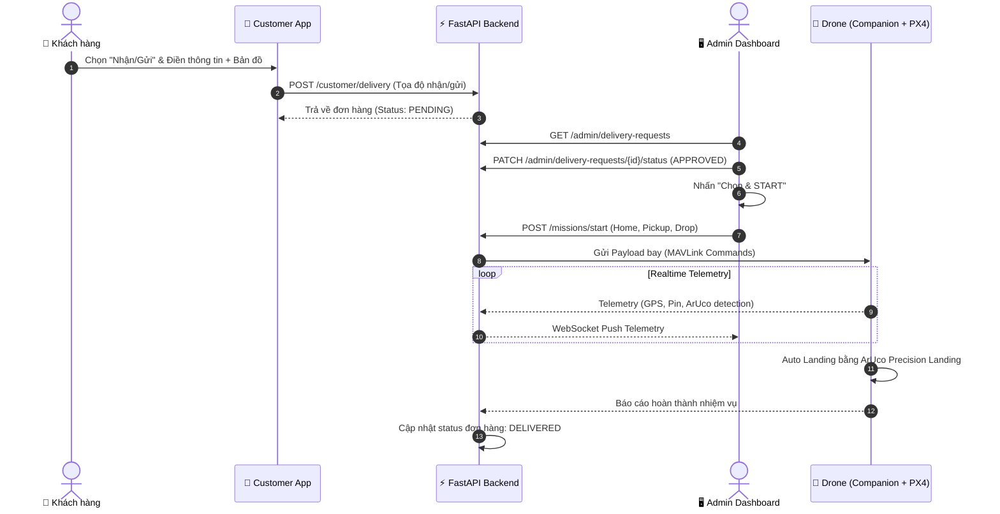
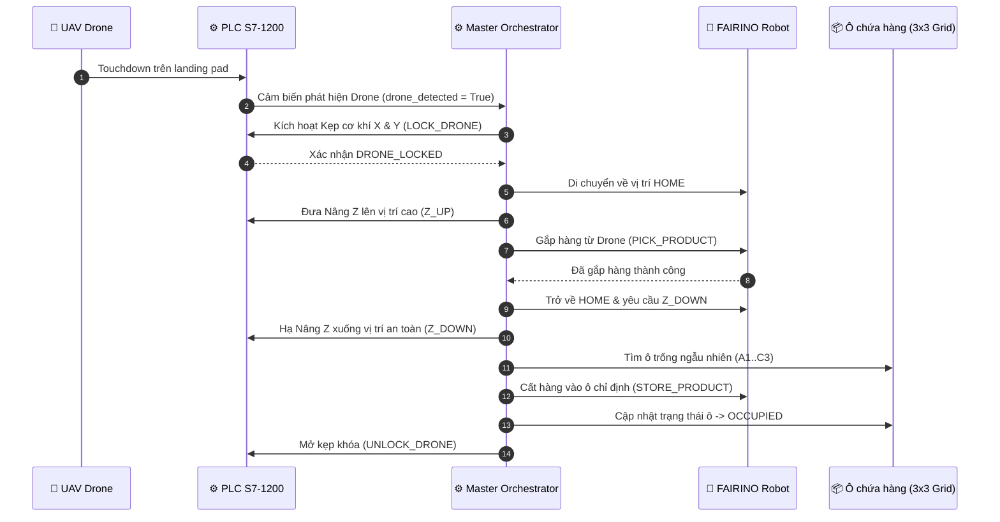
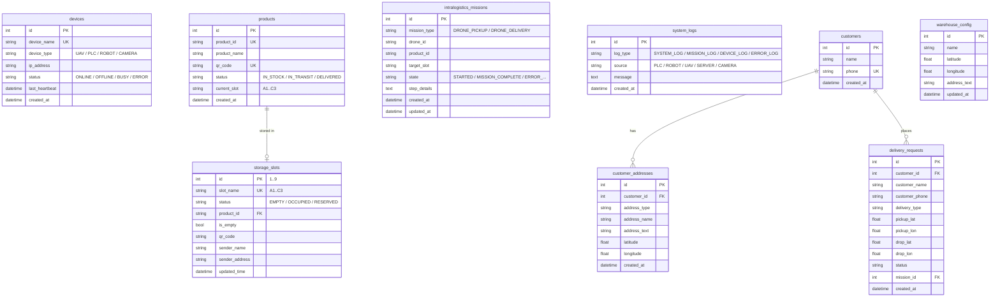
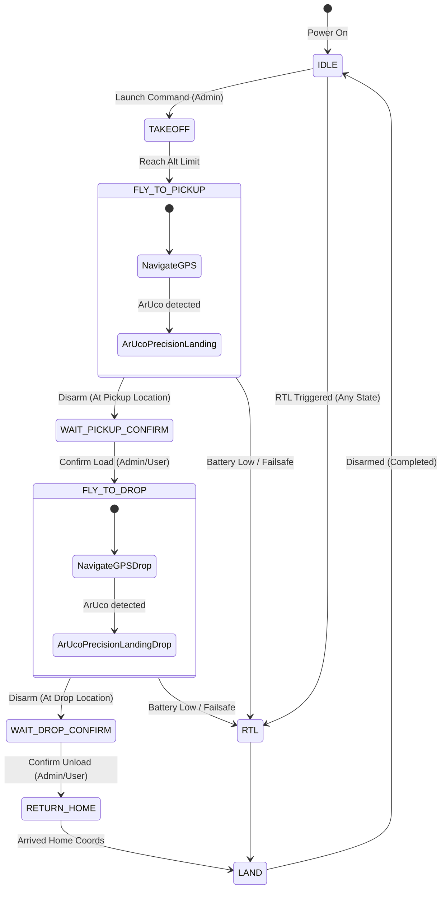

# Thiết kế Hệ thống (System Design v3.0)

Tài liệu này cung cấp cái nhìn tổng quát về kiến trúc hệ thống giao hàng bằng Drone kết hợp Trạm lưu kho thông minh (Smart Intralogistics Controller System), cơ sở dữ liệu v3.0, các giao thức kết nối LAN, và các máy trạng thái hữu hạn (FSM) điều phối đa thiết bị.

---

## 1. Sơ đồ Kiến trúc Hệ thống (v3.0)

```mermaid
graph TD
    subgraph ClientLayer [Client Applications & Controls]
        AdminApp["🖥️ Admin Dashboard (React + TS)<br/>Port: 5173 (Kho thông minh + Live Map)"]
        CustApp["📱 Customer App (React + TS)<br/>Port: 5174"]
    end

    subgraph ServerLayer [Centralized FastAPI Orchestration Engine]
        API["⚡ Central FastAPI Web App (v3.0)<br/>Port: 8000"]
        DB[(💾 SQLite Database<br/>drone_delivery.db)]
        WSMgr["🔌 WebSocket Hub<br/>/ws/system & /ws/drone"]
        Orchestrator["⚙️ Master Intralogistics FSM<br/>(MissionManager)"]
    end

    subgraph WarehouseHardware [LAN Hardware & Smart Warehouse]
        PLC["⚙️ Siemens S7-1200 PLC<br/>(Pad Sensor, Clamps X/Y, Z-Lift)"]
        ROBOT["🤖 FAIRINO Robot Arm<br/>(Cobot 6-DoF, Pick/Place A1..C3)"]
        CAM["📷 QR Code Vision Camera<br/>(Auto Scan & Slot Assign)"]
        GRID["📦 Ô chứa hàng 3x3<br/>(Slots A1..C3 Grid)"]
    end

    subgraph UAVHardware [UAV Drone & Flight Control]
        RPi["🍓 Raspberry Pi 5<br/>(Companion Computer)"]
        Pixhawk["🛸 Pixhawk 6C<br/>(PX4 Firmware / MAVLink)"]
        ArUcoCam["📷 RPi USB Cam<br/>(ArUco Precision Landing)"]
    end

    CustApp -->|HTTP REST| API
    AdminApp -->|HTTP REST| API
    AdminApp <-->|WebSockets (/ws/system)| WSMgr
    WSMgr <-->|WebSockets (/ws/drone)| RPi
    
    API <-->|SQLAlchemy Async| DB
    API <--> Orchestrator
    Orchestrator -->|PLC Commands| PLC
    Orchestrator -->|Robot Commands| ROBOT
    Orchestrator -->|Inventory Logic| GRID
    CAM -->|QR Payload API| API

    RPi <-->|MAVLink (UART)| Pixhawk
    RPi --> ArUcoCam

    style AdminApp fill:#2a3a52,stroke:#3b82f6,stroke-width:2px,color:#fff
    style CustApp fill:#1f2d45,stroke:#8b5cf6,stroke-width:2px,color:#fff
    style API fill:#111827,stroke:#10b981,stroke-width:2px,color:#fff
    style DB fill:#111827,stroke:#f59e0b,stroke-width:2px,color:#fff
    style PLC fill:#1e3a8a,stroke:#3b82f6,stroke-width:2px,color:#fff
    style ROBOT fill:#701a75,stroke:#c084fc,stroke-width:2px,color:#fff
    style RPi fill:#800020,stroke:#ef4444,stroke-width:2px,color:#fff
```

---

## 2. Luồng Nghiệp vụ Giao hàng & Kho thông minh

### 2.1. Luồng Giao hàng Khách hàng (Delivery Flow)

```mermaid
sequenceDiagram
    autonumber
    actor Customer as 👤 Khách hàng
    participant CustApp as 📱 Customer App
    participant Backend as ⚡ FastAPI Backend
    actor Admin as 🖥️ Admin Dashboard
    participant Drone as 🚁 Drone (Companion + PX4)

    Customer->>CustApp: Chọn "Nhận/Gửi" & Điền thông tin + Bản đồ
    CustApp->>Backend: POST /customer/delivery (Tọa độ nhận/gửi)
    Backend-->>CustApp: Trả về đơn hàng (Status: PENDING)
    
    Admin->>Backend: GET /admin/delivery-requests
    Admin->>Backend: PATCH /admin/delivery-requests/{id}/status (APPROVED)
    
    Admin->>Admin: Nhấn "Chọn & START"
    Admin->>Backend: POST /missions/start (Home, Pickup, Drop)
    Backend->>Drone: Gửi Payload bay (MAVLink Commands)
    
    loop Realtime Telemetry
        Drone-->>Backend: Telemetry (GPS, Pin, ArUco detection)
        Backend-->>Admin: WebSocket Push Telemetry
    end

    Drone->>Drone: Auto Landing bằng ArUco Precision Landing
    Drone-->>Backend: Báo cáo hoàn thành nhiệm vụ
    Backend->>Backend: Cập nhật status đơn hàng: DELIVERED
```

### 2.2. Luồng Nhập kho tự động khi Drone hạ cánh (Flow 8: DRONE_PICKUP)

```mermaid
sequenceDiagram
    autonumber
    participant UAV as 🚁 UAV Drone
    participant PLC as ⚙️ PLC S7-1200
    participant Orch as ⚙️ Master Orchestrator
    participant Robot as 🤖 FAIRINO Robot
    participant Storage as 📦 Ô chứa hàng (3x3 Grid)

    UAV->>PLC: Touchdown trên landing pad
    PLC->>Orch: Cảm biến phát hiện Drone (drone_detected = True)
    Orch->>PLC: Kích hoạt Kẹp cơ khí X & Y (LOCK_DRONE)
    PLC-->>Orch: Xác nhận DRONE_LOCKED
    Orch->>Robot: Di chuyển về vị trí HOME
    Orch->>PLC: Đưa Nâng Z lên vị trí cao (Z_UP)
    Orch->>Robot: Gắp hàng từ Drone (PICK_PRODUCT)
    Robot-->>Orch: Đã gắp hàng thành công
    Orch->>Robot: Trở về HOME & yêu cầu Z_DOWN
    Orch->>PLC: Hạ Nâng Z xuống vị trí an toàn (Z_DOWN)
    Orch->>Storage: Tìm ô trống ngẫu nhiên (A1..C3)
    Orch->>Robot: Cất hàng vào ô chỉ định (STORE_PRODUCT)
    Orch->>Storage: Cập nhật trạng thái ô -> OCCUPIED
    Orch->>PLC: Mở kẹp khóa (UNLOCK_DRONE)
```

---

## 3. Quy trình Trạng thái Kho thông minh (Intralogistics FSM)

### Flow 8: DRONE_PICKUP (Drone mang hàng về Kho nhập)
1. **STARTED**: Khởi tạo nhiệm vụ `DRONE_PICKUP`.
2. **TAKEOFF_AND_FLYING**: Drone di chuyển tới trạm hạ cánh kho.
3. **TOUCHDOWN**: Drone tiếp đất sàn hạ cánh. Cảm biến PLC nhận diện.
4. **DRONE_LOCKED**: PLC đóng kẹp cơ khí X & Y khóa chặt chân Drone.
5. **ROBOT_HOME**: Cánh tay Robot FAIRINO di chuyển về gốc HOME.
6. **Z_UP**: PLC điều khiển trục Z nâng lên độ cao nhận hàng.
7. **ROBOT_PICK**: Robot gắp hàng khỏi UAV.
8. **Z_DOWN**: PLC hạ trục Z về độ cao kho.
9. **STORE_SLOT**: InventoryManager tìm ô trống (A1..C3), Robot cất hàng vào ô.
10. **UNLOCK_DRONE**: PLC mở kẹp giải phóng Drone, hoàn tất nhiệm vụ (`MISSION_COMPLETE`).

### Flow 9: DRONE_DELIVERY (Xuất hàng từ Kho lên Drone)
1. **STARTED**: Khởi tạo nhiệm vụ `DRONE_DELIVERY`.
2. **FIND_PRODUCT**: Tìm vị trí sản phẩm trong ô lưu trữ (A1..C3).
3. **ROBOT_PICK_SLOT**: Robot gắp hàng từ ô lưu trữ & chuyển ô sang `EMPTY`.
4. **DRONE_LOCKED**: Drone tiếp đất & PLC đóng kẹp X/Y.
5. **Z_UP & PLACE**: Trục Z nâng lên, Robot đặt hàng lên Drone.
6. **Z_DOWN**: Trục Z hạ xuống, Robot rút về HOME.
7. **UNLOCK_DRONE**: PLC mở kẹp khóa, phát lệnh cấp phép cất cánh cho Drone (`MISSION_COMPLETE`).

---

## 4. Thiết kế Cơ sở Dữ liệu (ERD v3.0)

```mermaid
erDiagram
    devices {
        int id PK
        string device_name UK
        string device_type "UAV / PLC / ROBOT / CAMERA"
        string ip_address
        string status "ONLINE / OFFLINE / BUSY / ERROR"
        datetime last_heartbeat
        datetime created_at
    }

    products {
        int id PK
        string product_id UK
        string product_name
        string qr_code UK
        string status "IN_STOCK / IN_TRANSIT / DELIVERED"
        string current_slot "A1..C3"
        datetime created_at
    }

    storage_slots {
        int id PK "1..9"
        string slot_name UK "A1..C3"
        string status "EMPTY / OCCUPIED / RESERVED"
        string product_id FK
        bool is_empty
        string qr_code
        string sender_name
        string sender_address
        datetime updated_time
    }

    intralogistics_missions {
        int id PK
        string mission_type "DRONE_PICKUP / DRONE_DELIVERY"
        string drone_id
        string product_id
        string target_slot
        string state "STARTED / MISSION_COMPLETE / ERROR_..."
        text step_details
        datetime created_at
        datetime updated_at
    }

    system_logs {
        int id PK
        string log_type "SYSTEM_LOG / MISSION_LOG / DEVICE_LOG / ERROR_LOG"
        string source "PLC / ROBOT / UAV / SERVER / CAMERA"
        text message
        datetime created_at
    }

    customers {
        int id PK
        string name
        string phone UK
        datetime created_at
    }

    customer_addresses {
        int id PK
        int customer_id FK
        string address_type
        string address_name
        string address_text
        float latitude
        float longitude
        datetime created_at
    }

    delivery_requests {
        int id PK
        int customer_id FK
        string customer_name
        string customer_phone
        string delivery_type
        float pickup_lat
        float pickup_lon
        float drop_lat
        float drop_lon
        string status
        int mission_id FK
        datetime created_at
    }

    warehouse_config {
        int id PK
        string name
        float latitude
        float longitude
        string address_text
        datetime updated_at
    }

    customers ||--o{ customer_addresses : "has"
    customers ||--o{ delivery_requests : "places"
    products ||--o| storage_slots : "stored in"
```

---

## 5. Tài liệu API (RESTful Endpoints & WebSocket)

### 5.1. Smart Intralogistics API (v1 Router)
* **`GET /api/v1/devices`**: Danh sách tất cả thiết bị phần cứng trong mạng LAN.
* **`POST /api/v1/devices/register`**: Đăng ký thiết bị phần cứng mới.
* **`POST /api/v1/devices/heartbeat`**: Gửi heartbeat báo trạng thái Online.
* **`GET /api/v1/plc/status`**: Lấy trạng thái hiện tại của PLC (cảm biến sàn, kẹp X/Y, vị trí Z).
* **`POST /api/v1/plc/command`**: Gửi lệnh điều khiển PLC (`LOCK_DRONE`, `UNLOCK_DRONE`, `Z_UP`, `Z_DOWN`).
* **`GET /api/v1/robot/status`**: Lấy trạng thái Robot FAIRINO (State, slot, holding product).
* **`POST /api/v1/robot/command`**: Gửi lệnh Robot (`MOVE_HOME`, `PICK`, `STORE`, `REQUEST_Z_UP`, `REQUEST_Z_DOWN`).
* **`GET /api/v1/inventory/slots`**: Lấy thông tin 9 ô chứa hàng 3x3 (A1..C3).
* **`PUT /api/v1/inventory/slots/{slot_name}`**: Cập nhật trạng thái ô hàng.
* **`POST /api/v1/inventory/qr-scan`**: Nhận dữ liệu quét mã QR từ camera & tự động gán ô.
* **`POST /api/v1/missions/drone-pickup`**: Khởi chạy quy trình FSM DRONE_PICKUP (Flow 8).
* **`POST /api/v1/missions/drone-delivery`**: Khởi chạy quy trình FSM DRONE_DELIVERY (Flow 9).
* **`GET /api/v1/missions/active`**: Lấy thông tin nhiệm vụ FSM đang hoạt động.

### 5.2. WebSocket Realtime Hub
* **`WS /ws/system`**: Kênh Broadcast thông tin trạng thái toàn bộ hệ thống (Realtime Telemetry, PLC, Robot, ô chứa 3x3, và tiến trình FSM).
* **`WS /ws/drone/{drone_id}`**: Kênh WebSocket giao tiếp hai chiều với Companion Raspberry Pi trên Drone.

---

## 6. Máy Trạng thái Chuyến bay (Flight Control FSM)

```mermaid
stateDiagram-v2
    [*] --> IDLE : Power On
    IDLE --> TAKEOFF : Launch Command (Admin)
    TAKEOFF --> FLY_TO_PICKUP : Reach Alt Limit
    
    state FLY_TO_PICKUP {
        [*] --> NavigateGPS
        NavigateGPS --> ArUcoPrecisionLanding : ArUco detected
    }
    
    FLY_TO_PICKUP --> WAIT_PICKUP_CONFIRM : Disarm (At Pickup Location)
    WAIT_PICKUP_CONFIRM --> FLY_TO_DROP : Confirm Load (Admin/User)
    
    state FLY_TO_DROP {
        [*] --> NavigateGPSDrop
        NavigateGPSDrop --> ArUcoPrecisionLandingDrop : ArUco detected
    }
    
    FLY_TO_DROP --> WAIT_DROP_CONFIRM : Disarm (At Drop Location)
    WAIT_DROP_CONFIRM --> RETURN_HOME : Confirm Unload (Admin/User)
    
    RETURN_HOME --> LAND : Arrived Home Coords
    LAND --> IDLE : Disarmed (Completed)
    
    IDLE --> RTL : RTL Triggered (Any State)
    FLY_TO_PICKUP --> RTL : Battery Low / Failsafe
    FLY_TO_DROP --> RTL : Battery Low / Failsafe
    RTL --> LAND
```
